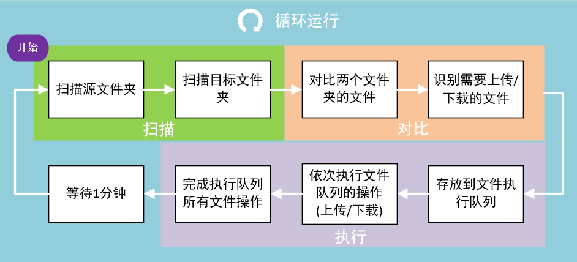
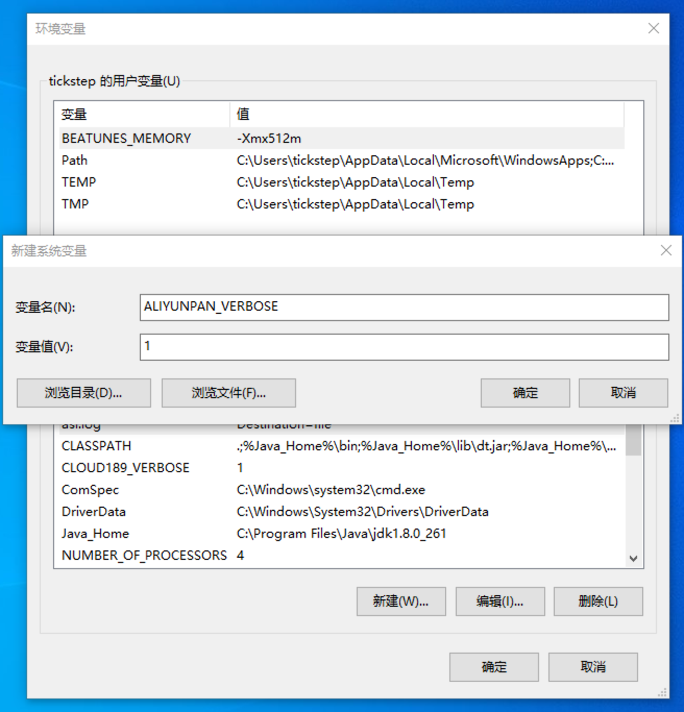
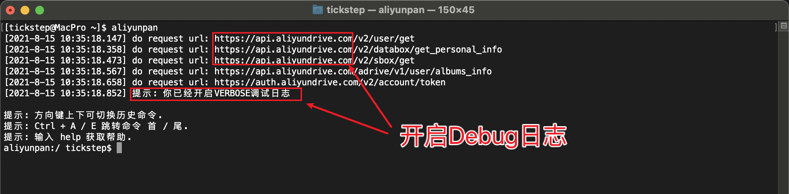
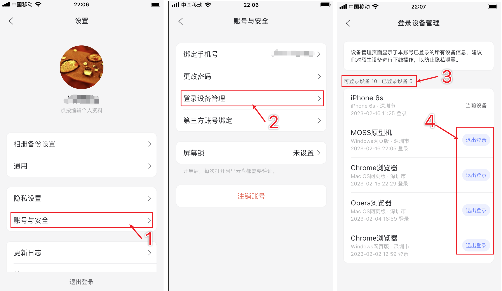
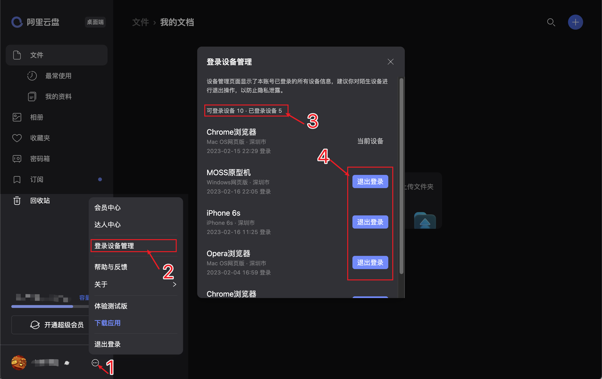

# 关于
阿里云盘CLI。仿 Linux shell 文件处理命令的阿里云盘命令行客户端，支持JavaScript插件，支持同步备份功能，支持相册批量下载。

# 特色
1. 多平台支持, 支持 Windows, macOS, linux(x86/x64/arm), android, iOS 等
2. 阿里云盘多用户支持
3. 支持备份盘，资源库无缝切换
4. [下载](docs/manual.md#下载文件目录)网盘内文件, 支持多个文件或目录下载, 支持断点续传和单文件并行下载。支持软链接(符号链接)文件。
5. [上传](docs/manual.md#上传文件目录)本地文件, 支持多个文件或目录上传，支持排除指定文件夹/文件（正则表达式）功能。支持软链接(符号链接)文件。
6. [同步备份功能](docs/manual.md#同步备份功能)支持备份本地文件到云盘，备份云盘文件到本地，双向同步备份保持本地文件和网盘文件同步。常用于嵌入式或者NAS等设备，支持docker镜像部署。
7. 命令和文件路径输入支持Tab键自动补全，路径支持通配符匹配模式
8. 支持[JavaScript插件](docs/plugin_manual.md#简介)，你可以按照自己的需要定制上传/下载中关键步骤的行为，最大程度满足自己的个性化需求
9. 支持共享相册的相关操作，支持批量下载相册所有普通照片、实况照片文件到本地
10. 支持多用户联合下载功能，对下载速度有极致追求的用户可以尝试使用该选项。详情请查看文档[多用户联合下载](docs/manual.md#多用户联合下载)

# 阿里云盘VIP会员推荐码
如果大家有打算开通阿里云盘VIP会员，可以使用阿里云盘APP扫描下面的优惠推荐码进行开通。    
注意：您需要开通【三方应用权益包】，这样使用本程序下载才能加速，否则下载无法提速。   


# 目录
- [关于](#关于)
- [特色](#特色)
- [目录](#目录)
- [如何安装](#如何安装)
  - [直接下载安装](#直接下载安装)
  - [apt安装](#apt安装)
  - [yum安装](#yum安装)
  - [brew安装](#brew安装)
  - [winget安装](#winget安装)
  - [docker安装](#docker安装)
    - [sync同步盘](#sync同步盘)
- [如何使用](#如何使用)
  - [基本使用](#基本使用)
    - [修改配置目录](#修改配置目录)
    - [启动程序](#启动程序)
    - [查看帮助](#查看帮助)
    - [登录](#登录)
    - [切换网盘](#切换网盘)
    - [查看文件列表](#查看文件列表)
    - [下载文件](#下载文件)
    - [上传文件](#上传文件)
    - [同步备份文件](#同步备份文件)
  - [更多命令](#更多命令)
- [常见问题](#常见问题)
  - [如何开启Debug调试日志](#如何开启debug调试日志)
    - [第一步](#第一步)
    - [第二步](#第二步)
  - [如何登出和下线客户端](#如何登出和下线客户端)
- [交流反馈](#交流反馈)
- [鸣谢](#鸣谢)

# 如何安装
## 直接下载安装
可以直接在本仓库 [发布页](https://github.com/tickstep/aliyunpan/releases) 下载安装包，解压后使用。   
   
要特别注意安装包的标签，不同的标签对应不同架构的系统，相关版本文件的标签说明如下：
1. arm / armv5 / armv7 : 适用32位ARM系统
2. arm64 : 适用64位ARM系统
3. 386 / x86 : 适用32系统，包括Intel和AMD的CPU系统
4. amd64 / x64 : 适用64位系统，包括Intel和AMD的CPU系统
5. mips : 适用MIPS指令集的CPU，例如中标麒麟的系统。MIPS要注意大小端字序的不同对应的版本也不同。
6. macOS amd64适用Intel CPU的机器，macOS arm64目前主要是适用苹果M系列芯片的机器
7. iOS arm64适用iPhone手机，并且必须是越狱的手机才能正常运行
8. loong64 : 适用于LoongArch64架构的机器，例如国产龙芯CPU

参考例子：
```shell
wget https://github.com/tickstep/aliyunpan/releases/download/v0.3.6/aliyunpan-v0.3.6-linux-amd64.zip
unzip aliyunpan-v0.3.6-linux-amd64.zip
cd aliyunpan-v0.3.6-linux-amd64
./aliyunpan
```

## apt安装
适用于apt包管理器的系统，例如Ubuntu，国产deepin深度操作系统等。目前只支持amd64和arm64架构的机器。
```shell
sudo curl -fsSL http://file.tickstep.com/apt/pgp | gpg --dearmor | sudo tee /etc/apt/trusted.gpg.d/tickstep-packages-archive-keyring.gpg > /dev/null && echo "deb [signed-by=/etc/apt/trusted.gpg.d/tickstep-packages-archive-keyring.gpg arch=amd64,arm64] http://file.tickstep.com/apt aliyunpan main" | sudo tee /etc/apt/sources.list.d/tickstep-aliyunpan.list > /dev/null && sudo apt-get update && sudo apt-get install -y aliyunpan
 
```

## yum安装
适用于yum包管理器的系统，例如CentOS、RockyLinux等。目前只支持amd64和arm64架构的机器。
```shell
sudo curl -fsSL http://file.tickstep.com/rpm/aliyunpan/aliyunpan.repo | sudo tee /etc/yum.repos.d/tickstep-aliyunpan.repo > /dev/null && sudo yum install aliyunpan -y
 
```

## brew安装
适用于brew包管理器的系统，主要是苹果macOS系统。目前只支持amd64和arm64架构(Apple Silicon)的机器。
```shell
brew install aliyunpan
    
```
由于brew默认安装在系统目录下面，这样配置文件也默认存放在系统目录里了，建议设置系统变量进行配置文件的单独存储，例如
```shell
export ALIYUNPAN_CONFIG_DIR=/Users/tickstep/Applications/adrive/config
```

## winget安装
适用于Windows系统的winget包管理器。目前只支持x86和x64架构的机器。  
    
更新源（可选）
```powershell
winget source update
 
```
安装
```powershell
winget install tickstep.aliyunpan --silent
 
```

## docker安装
### sync同步盘
同步备份功能，支持备份本地文件到云盘，备份云盘文件到本地两种模式。支持JavaScript插件对备份文件进行过滤。
备份功能支持以下模式：
1. 备份本地文件，即上传本地文件到网盘，始终保持本地文件有一个完整的备份在网盘
2. 备份云盘文件，即下载网盘文件到本地，始终保持网盘的文件有一个完整的备份在本地
   
备份功能支持指定备份策略：
1. exclusive，排他备份文件（一比一镜像备份），目标目录多余的文件会被删除。保证备份的源目录，和目标目录文件一比一备份。源目录文件如果文件被删除，则对应的目标目录的文件也会被删除。
2. increment，增量备份文件，目标目录多余的文件不会被删除。只会把源目录修改的文件，新增的文件备份到目标目录。如果源目录有文件删除，或者目标目录有其他文件新增是不会被删除。
   
同步的基本逻辑如下所示，一次循环包括：扫描-对比-执行，一共三个环节。   


```
docker run -d --name=aliyunpan-sync --restart=always -v "<your aliyunpan_config.json>:/home/app/config/aliyunpan_config.json" -v "<your local dir>:/home/app/data" -e ALIYUNPAN_PAN_DIR="<your drive pan dir>" -e ALIYUNPAN_SYNC_MODE="upload" -e ALIYUNPAN_SYNC_POLICY="increment" -e ALIYUNPAN_SYNC_DRIVE="backup" -e ALIYUNPAN_SYNC_LOG="true" tickstep/aliyunpan-sync:v0.3.6 
  
<your aliyunpan_config.json>: 用户已经登录成功并保存好的aliyunpan_config.json凭据文件
<your local dir>：本地目标目录，绝对路径，例如：/tickstep/Documents/设计文档
ALIYUNPAN_PAN_DIR：云盘目标目录，绝对路径
ALIYUNPAN_SYNC_MODE：备份模式，支持: upload(备份本地文件到云盘),download(备份云盘文件到本地)
ALIYUNPAN_SYNC_POLICY：备份策略，支持：exclusive(排他备份文件，目标目录多余的文件会被删除),increment(增量备份文件，目标目录多余的文件不会被删除)
ALIYUNPAN_SYNC_DRIVE: 网盘，支持：backup(备份盘), resource(资源盘)
ALIYUNPAN_SYNC_LOG: 同步日志，true-开启同步日志显示，false-关闭同步日志
```
docker-compose启动方式请查看：[docker-compose.yml](https://github.com/tickstep/aliyunpan/blob/main/docs/manual.md#Docker%E8%BF%90%E8%A1%8C)   
更详情文档请参考dockerhub网址：[tickstep/aliyunpan-sync](https://hub.docker.com/r/tickstep/aliyunpan-sync)

# 如何使用
完整和详细的命令说明请查看手册：[命令手册](docs/manual.md)   

1. Windows
   程序应在 命令提示符 (Command Prompt) 或 PowerShell 中运行.   
   也可直接双击程序运行, 具体使用方法请参见 [命令列表及说明](docs/manual.md#命令列表及说明)

2. Linux / macOS
   程序应在 终端 (Terminal) 运行.   
   具体使用方法请参见 [命令列表及说明](docs/manual.md#命令列表及说明)   

如果程序运行时输出乱码, 请检查下终端的编码方式是否为 `UTF-8`.   

如果没有带任何参数运行程序, 程序将会进入仿Linux shell系统用户界面的CLI交互模式, 可直接运行相关命令.   
在交互模式下, 光标所在行的前缀应为 `aliyunpan >`, 如果登录了帐号则格式为 `aliyunpan:<工作目录> <用户昵称>$ `  
   
程序内置了相关命令的使用说明，你可以通过运行`命令 -h`的方式获取命令的使用说明，例如：`upload -h`获取上传命令的使用说明。   

## 基本使用
本程序支持阿里云盘大多数命令操作，这里只介绍基本的使用，更多更详细的命令请查看手册：[命令手册](docs/manual.md)。

### 修改配置目录
你可以指定程序配置文件的存储路径，如果没有指定，程序会使用默认的目录。   
方法为设置环境变量`ALIYUNPAN_CONFIG_DIR`并指定一个存在的目录，例如linux下面可以这样指定
```shell
export ALIYUNPAN_CONFIG_DIR=/home/tickstep/tools/aliyunpan/config
```

### 启动程序
直接启动进入交互命令行
```shell
[tickstep@MacPro ~]$ aliyunpan
提示: 方向键上下可切换历史命令.
提示: Ctrl + A / E 跳转命令 首 / 尾.
提示: 输入 help 获取帮助.
aliyunpan > 
```

### 查看帮助
```shell
aliyunpan > help

...
   阿里云盘:
     album, abm   相簿(Beta)
     cd           切换工作目录
     download, d  下载文件/目录
     ls, l, ll    列出目录
     mkdir        创建目录
     mv           移动文件/目录
     pwd          输出工作目录
     recycle      回收站
     rename       重命名文件
     rm           删除文件/目录
     share        分享文件/目录
     sync         同步备份功能
     upload, u    上传文件/目录
...
```

### 登录
需要先登录，已经登录过的可以跳过此步。登录是在浏览器上进行，你需要进行两次登录。
```shell
aliyunpan > login
请在浏览器打开以下链接进行登录，链接有效时间为5分钟。
注意：你需要进行一次授权一次扫码的两次登录。
https://openapi.alipan.com/oauth/authorize?client_id=cf9f70e8fc61430f8ec5ab5cadf31375&redirect_uri=https%3A%2F%2Fapi.tickstep.com%2Fauth%2Ftickstep%2Faliyunpan%2Ftoken%2Fopenapi%2F8206f0.....fb5db6b40336%2Fauth&scope=user:base,file:all:read,file:all:write
阿里云盘登录成功:  tickstep
aliyunpan:/ tickstep$ 
```

### 切换网盘
支持切换备份盘、资源库，默认工作在备份盘下。
```shell
aliyunpan:/ tickstep(备份盘)$ drive
  #   DRIVE ID   网盘名称  
  1    11519221   备份盘   
  2  1311893110   资源库   
  
输入要切换的网盘 # 值 > 2
切换到网盘：资源库                     
aliyunpan:/ tickstep(资源库)$ 
```

### 查看文件列表
```shell
aliyunpan:/ tickstep$ ls

  #  文件大小       修改日期               文件(目录)                             
  0         -  2021-11-03 13:32:22  临时/                     
  1         -  2021-07-10 07:44:34  好友的分享/               
  2         -  2021-07-09 22:11:22  我的项目/                 
  3         -  2021-07-09 22:10:37  我的游戏/       
  4         -  2021-07-09 22:10:10  我的文档/       
  5  349.86KB  2021-06-06 11:46:02  使用统计.xls                                            
  6  503.57KB  2021-06-06 11:46:02  IMG_0098.JPG                                            
  7   72.20KB  2021-06-06 11:46:02  IMG_0103.PNG 
       总: 3.20MB                   文件总数: 3, 目录总数: 7  
----
```

### 下载文件
通过 `aliyunpan config set -savedir <savedir>` 可以自定义下载文件保存的目录。
```shell
aliyunpan:/ tickstep$ download IMG_0106.JPG

[0] 当前文件下载最大并发量为: 5, 下载缓存为: 64.00KB
[1] 加入下载队列: /IMG_0106.JPG
[1] ----
文件ID: 60bc44f855814e19692a4958b4a8823a1a06e5de
文件名: IMG_0106.JPG
文件类型: 文件
文件路径: /IMG_0106.JPG

[1] 准备下载: /IMG_0106.JPG
[1] 将会下载到路径: /root/Downloads/4d001d48564f43b..62874f04bbe6/IMG_0106.JPG
[1] 下载开始
[1] ↓ 704.00KB/1.48MB 0B/s(1.69MB/s) in 1.88s, left - ............
[1] 下载完成, 保存位置: /root/Downloads/4d001d48564f43b..62874f04bbe6/IMG_0106.JPG
[1] 检验文件有效性成功: /root/Downloads/4d001d48564f43b..62874f04bbe6/IMG_0106.JPG

下载结束, 时间: 4秒, 数据总量: 1.48MB
aliyunpan:/ tickstep$ 
```

### 上传文件
```shell
aliyunpan:/ tickstep$ upload /Users/tickstep/Downloads/apt.zip /tmp

[0] 当前文件上传最大并发量为: 10, 上传分片大小为: 10.00MB
[1] 加入上传队列: /Users/tickstep/Downloads/apt.zip
[1] 2022-08-13 13:41:22 准备上传: /Users/tickstep/Downloads/apt.zip => /tmp/apt.zip
[1] 2022-08-13 13:41:22 正在检测和创建云盘文件夹: /tmp
[1] 2022-08-13 13:41:22 正在计算文件SHA1: /Users/tickstep/Downloads/apt.zip
[1] 2022-08-13 13:41:22 检测秒传中, 请稍候...
[1] 2022-08-13 13:41:22 秒传失败，开始正常上传文件
[1] ↑ 21.00MB/21.00MB 702.53KB/s(702.70KB/s) in 15s ............
[1] 2022-08-13 13:41:22 上传文件成功, 保存到网盘路径: /tmp/apt.zip
[1] 2022-08-13 13:41:22 文件上传结果： 成功！ 耗时 18秒

上传结束, 时间: 18秒, 数据总量: 21.00MB
```

### 同步备份文件
同步备份功能，支持备份本地文件到云盘，备份云盘文件到本地，双向同步备份三种模式。支持JavaScript插件对备份文件进行过滤。   
   
例如：将本地目录 `/tickstep/Documents/设计文档` 中的文件备份上传到云盘目录 `/备份盘/我的文档`
```shell
aliyunpan:/ tickstep$ sync start -ldir "/tickstep/Documents/设计文档" -pdir "/备份盘/我的文档" -mode "upload" -drive "backup"

启动同步备份进程
备份配置文件：(使用命令行配置)
链接类型：默认链接
下载并发：2
上传并发：2
下载分片大小：1.00MB
上传分片大小：10.00MB

启动同步任务
任务: 设计文档(de3d6b69a607497b73624bcca0845f19)
同步模式: 备份本地文件（只上传）
本地目录: /tickstep/Documents/设计文档
云盘目录: /备份盘/我的文档
```

## 更多命令
更多更详细的命令请查看手册：[命令手册](docs/manual.md)。

# 常见问题
## 如何开启Debug调试日志
当需要定位问题，或者提交issue的时候抓取log，则需要开启debug日志。步骤如下：

### 第一步
Linux&MacOS   
命令行运行
```
export ALIYUNPAN_VERBOSE=1
```

Windows   
不同版本会有些许不一样，请自行查询具体方法   
设置示意图如下：   


### 第二步
打开aliyunpan命令行程序，任何云盘命令都有类似如下日志输出   


## 如何登出和下线客户端
阿里云盘单账户最多只允许同时登录 10 台设备   
当出现这个提示：你账号已超出最大登录设备数量，请先下线一台设备，然后重启本应用，才可以继续使用   
说明你的账号登录客户端已经超过数量，你需要先登出其他客户端才能继续使用，如下所示   
   
APP手机端   

Web网页端   


# 交流反馈
提交issue: [issues页面](https://github.com/tickstep/aliyunpan/issues)   
联系邮箱: tickstep@outlook.com

# 鸣谢
本项目大量借鉴了以下相关项目的功能&成果   
> [tickstep/aliyunpan-api](https://github.com/tickstep/aliyunpan-api)   
> [tickstep/cloudpan189-go](https://github.com/tickstep/cloudpan189-go)   
> [kazutoiris/ali_ecc](https://github.com/kazutoiris/ali_ecc)   