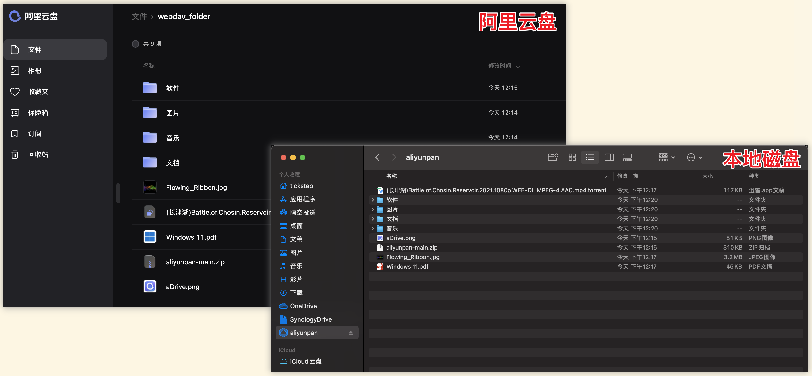

# 关于
阿里云盘CLI。仿 Linux shell 文件处理命令的阿里云盘命令行客户端，支持webdav文件协议。

# 特色
1. 多平台支持, 支持 Windows, macOS, linux(x86/x64/arm), android, iOS 等
2. 阿里云盘多用户支持
3. 支持文件网盘，相册网盘无缝切换
4. ~~支持导入/导出功能，快速备份（导出）和恢复（导入）网盘的文件~~
5. [下载](#下载文件目录)网盘内文件, 支持多个文件或目录下载, 支持断点续传和单文件并行下载
6. [上传](#上传文件目录)本地文件, 支持多个文件或目录上传，支持排除指定文件夹/文件（正则表达式）功能
7. [备份本地文件](#备份本地文件目录)支持备份本地文件夹到网盘中，保持本地文件和网盘文件同步。常用于嵌入式或者NAS等设备。
8. 命令和文件路径输入支持Tab键自动补全
9. 支持阿里云ECS环境下使用内网链接上传/下载，速度更快(轻松突破100MB/s)，还可以节省公网带宽流量(配置transfer_url_type=2即可)
10. 支持webdav文件协议，可以将阿里云盘当做webdav文件网盘挂载到Windows, macOS, linux的磁盘中进行使用。webdav部署支持docker镜像，镜像只有不到10MB非常小巧。

# 重要提示
***由于阿里上传接口更改，目前上传文件需要原始文件的片段信息，故之前的"手动秒传"，"导入"，"导出"，"秒传链接分享"功能全部无法使用。新版本暂时屏蔽了该功能，请知悉。***

# 相关说明
1. 本项目还处于开发阶段，未经过充分的测试，如有bug或者好的建议欢迎提交issue
2. 由于阿里云盘还在内测中，后面功能和接口随时会被修改，相对应的，本工具相关功能也会被影响
3. 目前阶段优先处理Bug，功能增强的开发会相对往后安排

# 版本标签说明
1. arm / armv5 / armv7 : 适用32位ARM系统
2. arm64 : 适用64位ARM系统
3. 386 / x86 : 适用32系统，包括Intel和AMD的CPU系统
4. amd64 / x64 : 适用64位系统，包括Intel和AMD的CPU系统
5. mips : 适用MIPS指令集的CPU，例如国产龙芯CPU
6. macOS amd64适用Intel CPU的机器，macOS arm64目前主要是适用苹果M1芯片的机器
7. iOS arm64适用iPhone手机，并且必须是越狱的手机才能正常运行

# 目录
- [特色](#特色)
- [下载/运行 说明](#下载运行说明)
  * [Windows](#windows)
  * [Linux / macOS](#linux--macos)
- [命令列表及说明](#命令列表及说明)
  * [注意](#注意)
  * [修改配置文件存储路径](#修改配置文件存储路径)
  * [检测程序更新](#检测程序更新)
  * [查看帮助](#查看帮助)
  * [登录阿里云盘帐号](#登录阿里云盘帐号)
  * [列出帐号列表](#列出帐号列表)
  * [获取当前帐号](#获取当前帐号)
  * [切换阿里云盘帐号](#切换阿里云盘帐号)
  * [退出阿里云盘帐号](#退出阿里云盘帐号)
  * [刷新Token](#刷新Token) 
  * [切换网盘(文件/相册)](#切换网盘)
  * [获取网盘配额](#获取网盘配额)
  * [切换工作目录](#切换工作目录)
  * [输出工作目录](#输出工作目录)
  * [列出目录](#列出目录)
  * [下载文件/目录](#下载文件目录)
  * [上传文件/目录](#上传文件目录)
  * [备份本地文件/目录](#备份本地文件目录)  
  * [手动秒传文件](#手动秒传文件)
  * [创建目录](#创建目录)
  * [删除文件/目录](#删除文件目录)
  * [移动文件/目录](#移动文件目录)
  * [重命名文件/目录](#重命名文件目录)
  * [导出文件](#导出文件)
  * [导入文件](#导入文件)
  * [分享文件/目录](#分享文件目录)
    + [设置分享文件/目录](#设置分享文件目录)
    + [列出已分享文件/目录](#列出已分享文件目录)
    + [取消分享文件/目录](#取消分享文件目录)
    + [分享秒传链接](#分享秒传链接)
  * [webdav文件服务](#webdav文件服务)   
    + [常用命令说明](#常用命令说明)
    + [命令行启动](#命令行启动)
    + [Linux后台启动](#Linux后台启动)
    + [Docker运行](#Docker运行)
    + [HTTPS配置](#HTTPS配置)
  * [显示和修改程序配置项](#显示和修改程序配置项)
- [常见问题Q&A](#常见问题Q&A)  
  * [1. 如何获取RefreshToken](#1-如何获取RefreshToken)
  * [2. 如何开启Debug调试日志](#2-如何开启Debug调试日志)
  * [3. 解决 time: missing Location in call to Date 问题](#3-解决-missing-Location-in-call-to-Date-问题)
- [交流反馈](#交流反馈)
- [鸣谢](#鸣谢)

# 下载/运行说明

可以直接在[发布页](https://github.com/tickstep/aliyunpan/releases)下载使用.

也可以使用这个天翼云盘分享链接（阿里云盘还不支持zip压缩包分享）进行下载：[下载链接](https://cloud.189.cn/t/z2auuiFfYb2i)（访问码：5o9b）

如果程序运行时输出乱码, 请检查下终端的编码方式是否为 `UTF-8`.

使用本程序之前, 非常建议先学习一些 linux 基础命令知识.

如果没有带任何参数运行程序, 程序将会进入仿Linux shell系统用户界面的cli交互模式, 可直接运行相关命令.

cli交互模式下, 光标所在行的前缀应为 `aliyunpan >`, 如果登录了帐号则格式为 `aliyunpan:<工作目录> <用户昵称>$ `

程序会提供相关命令的使用说明.

## Windows

程序应在 命令提示符 (Command Prompt) 或 PowerShell 中运行.

也可直接双击程序运行, 具体使用方法请参见 [命令列表及说明](#命令列表及说明).

## Linux / macOS

程序应在 终端 (Terminal) 运行.

具体使用方法请参见 [命令列表及说明](#命令列表及说明) .


# 命令列表及说明

## 注意

命令的前缀 `aliyunpan` 为指向程序运行的全路径名 (ARGv 的第一个参数)

直接运行程序时, 未带任何其他参数, 则程序进入cli交互模式, 进入cli模式运行以下命令时要把命令的前缀 `aliyunpan` 去掉! 即不需要输入`aliyunpan`。

cli交互模式支持按tab键自动补全命令.

## 修改配置文件存储路径
设置环境变量ALIYUNPAN_CONFIG_DIR并指定一个存在目录即可，注意目录需要是绝对路径
```
例如linux下面可以这样指定

export ALIYUNPAN_CONFIG_DIR=/home/tickstep/tools/aliyunpan/config
```

## 检测程序更新
```
aliyunpan update
```

## 查看帮助
```
aliyunpan help
```
### 例子
```
列出程序支持的命令
aliyunpan help

查看login命令的帮助手册
aliyunpan help login
```

## 登录阿里云盘帐号

### 登录
当前支持使用RefreshToken进行登录。RefreshToken请参考 [1. 如何获取RefreshToken](#1-如何获取RefreshToken) 获取
```
aliyunpan login
```

### 例子
```
按照引导步骤登录
aliyunpan login
请输入RefreshToken, 回车键提交 > 626a27b6193f4c5ca6ef0.......

命令行指定RefreshToken登录
aliyunpan login -RefreshToken=626a27b6193f4c5ca6ef0.......
```


## 列出帐号列表

```
aliyunpan loglist
```

列出所有已登录的帐号

## 获取当前帐号

```
aliyunpan who
```

## 切换阿里云盘帐号

切换已登录的帐号
```
aliyunpan su <uid>
```
```
aliyunpan su

请输入要切换帐号的 # 值 >
```

## 退出阿里云盘帐号

退出当前登录的帐号
```
aliyunpan logout
```

程序会进一步确认退出帐号, 防止误操作.

## 刷新Token
由于阿里云盘的RefreshToken是会过期的，为了延长最大过期时间，需要定期刷新Token，建议每小时刷新一次。
调用该命令可以自动刷新RefreshToken并保存到配置文件中，但是有一个前提，即Token必须还没有过期，如果Token已经过期是无法刷新的则只能重新登录。
```
刷新当前登录用户
aliyunpan token update

刷新所有登录的用户
aliyunpan token update -mode 2
```

如果你的aliyunpan工具是在Linux中运行，则建议你使用crontab定时任务进行Token自动刷新，例如
```
每小时执行一次Token刷新任务
*/60  * * * * /<your path>/aliyunpan token update -mode 2
```

## 切换网盘
程序默认工作在文件网盘下，如需切换到相册网盘，可以使用本命令进行切换。
```
aliyunpan drive <driveId>
```
```
aliyunpan drive

输入要切换的网盘 # 值 >
```

## 获取网盘配额

```
aliyunpan quota
```
获取网盘的总储存空间, 和已使用的储存空间

## 切换工作目录
```
aliyunpan cd <目录>
```

### 例子
```
# 切换 /我的文档 工作目录
aliyunpan cd /我的文档

# 切换 上级目录
aliyunpan cd ..

# 切换 根目录
aliyunpan cd /

```

## 输出工作目录
```
aliyunpan pwd
```

## 列出目录

列出当前工作目录的文件和目录或指定目录
```
aliyunpan ls
```
```
aliyunpan ls <目录>
```

### 可选参数
```
-driveId value  网盘ID
```

### 例子
```
# 列出 我的文档 内的文件和目录
aliyunpan ls 我的文档

# 绝对路径
aliyunpan ls /我的文档

# 详细列出 我的文档 内的文件和目录
aliyunpan ll /我的文档
```

## 下载文件/目录
```
aliyunpan download <网盘文件或目录的路径1> <文件或目录2> <文件或目录3> ...
aliyunpan d <网盘文件或目录的路径1> <文件或目录2> <文件或目录3> ...
```

### 可选参数
```
  --ow            overwrite, 覆盖已存在的文件
  --status        输出所有线程的工作状态
  --save          将下载的文件直接保存到当前工作目录
  --saveto value  将下载的文件直接保存到指定的目录
  -x              为文件加上执行权限, (windows系统无效)
  -p value        指定下载线程数 (default: 0)
  -l value        指定同时进行下载文件的数量 (default: 0)
  --retry value   下载失败最大重试次数 (default: 3)
  --nocheck       下载文件完成后不校验文件
  --exn value     指定排除的文件夹或者文件的名称，只支持正则表达式。支持排除多个名称，每一个名称就是一个exn参数
```


### 例子
```
# 设置保存目录, 保存到 D:\Downloads
# 注意区别反斜杠 "\" 和 斜杠 "/" !!!
aliyunpan config set -savedir D:/Downloads

# 下载 /我的文档/1.mp4
aliyunpan d /我的文档/1.mp4

# 下载 /我的文档 整个目录!!
aliyunpan d /我的文档
```

下载的文件默认保存到 **程序所在目录** 的 download/ 目录, 支持设置指定目录, 重名的文件会自动跳过!

通过 `aliyunpan config set -savedir <savedir>` 可以自定义保存的目录.

支持多个文件或目录下载.

自动跳过下载重名的文件!

## 上传文件/目录
上传支持两种链接类型：1-默认类型 2-阿里ECS环境类型   
在阿里ECS环境下，上传速度单文件可以轻松达到30MB/s，多文件可以突破100MB/s   


```
aliyunpan upload <本地文件/目录的路径1> <文件/目录2> <文件/目录3> ... <目标目录>
aliyunpan u <本地文件/目录的路径1> <文件/目录2> <文件/目录3> ... <目标目录>
```

### 例子:
```
# 将本地的 C:\Users\Administrator\Desktop\1.mp4 上传到网盘 /视频 目录
# 注意区别反斜杠 "\" 和 斜杠 "/" !!!
aliyunpan upload C:/Users/Administrator/Desktop/1.mp4 /视频

# 将本地的 C:\Users\Administrator\Desktop\1.mp4 和 C:\Users\Administrator\Desktop\2.mp4 上传到网盘 /视频 目录
aliyunpan upload C:/Users/Administrator/Desktop/1.mp4 C:/Users/Administrator/Desktop/2.mp4 /视频

# 将本地的 C:\Users\Administrator\Desktop 整个目录上传到网盘 /视频 目录
aliyunpan upload C:/Users/Administrator/Desktop /视频

## 下面演示文件或者文件夹排除功能

# 将本地的 C:\Users\Administrator\Video 整个目录上传到网盘 /视频 目录，但是排除所有的.jpg文件
aliyunpan upload -exn "\.jpg$" C:/Users/Administrator/Video /视频

# 将本地的 C:\Users\Administrator\Video 整个目录上传到网盘 /视频 目录，但是排除所有的.jpg文件和.mp3文件，每一个排除项就是一个exn参数
aliyunpan upload -exn "\.jpg$" -exn "\.mp3$" C:/Users/Administrator/Video /视频

以下是典型的排除特定文件或者文件夹的例子，注意：参数值必须是正则表达式
1)排除@eadir文件或者文件夹：-exn "^@eadir$"
2)排除.jpg文件：-exn "\.jpg$"
3)排除.号开头的文件：-exn "^\."
4)排除~号开头的文件：-exn "^~"
5)排除 myfile.txt 文件：-exn "^myfile.txt$"
```

## 备份本地文件/目录

本地备份功能一般用于NAS等系统，日常只进行增量备份操作，默认情况下本地删除不影响网盘文件。

比如在手机上备分照片目录，就可以使用这个功能定时备份，备份完成后本地文件可安全删除。

基本用法和`upload`命令一样，额外增加两个参数

>1. delete 用于同步删除操作（只通过本地数据库记录对比）。 
>2. sync 使网盘上的文件和本地文件同步（本地为主），会删除网盘中不存在于本地的文件或目录（速度比较慢）。  
>sync 和 delete 的区别在于sync是通过网盘文件列表和本地文件进行判断。  
>delete 只通过本地数据库进行判断,正常情况下使用 delete 就够用了。
 
和 `upload` 相比由于增加了本地数据库，可以快速判断文件是否有更新等，大大减少了 API 的调用，操作速度更快。

```
aliyunpan backup <本地目录1> <目录2> <目录3> ... <目标目录>
注：
1. 默认不删除网盘文件，可用 delete 或 sync 参数进行同步删除。
```

### 例子:
```
# 将本地的 C:\Users\Administrator\Desktop 备份到网盘 /test 目录
# 注意区别反斜杠 "\" 和 斜杠 "/" !!!
aliyunpan backup C:/Users/Administrator/Desktop /test

# 将本地的 C:\Users\Administrator\Desktop 备份到网盘 /test 目录，但排除所有 @eadir 目录
aliyunpan backup -exn "^@eadir$" C:/Users/Administrator/Desktop /test
```

## 手动秒传上传文件
通过秒传链接上传文件到网盘，秒传链接可以通过share命令获取
```
aliyunpan rapidupload <秒传链接1> <秒传链接2> <秒传链接3> ...
```

### 例子:
```
# 如果秒传成功, 则保存到网盘路径 /file.dmg
aliyunpan rapidupload "aliyunpan://file.dmg|752FCCBFB2436A6FFCA3B287831D4FAA5654B07E|7005440|"

# 如果秒传成功, 则保存到网盘路径 /pan_folder/file.dmg
aliyunpan rapidupload "aliyunpan://file.dmg|752FCCBFB2436A6FFCA3B287831D4FAA5654B07E|7005440|pan_folder"

```

## 创建目录
```
aliyunpan mkdir <目录>
```

### 例子
```
aliyunpan mkdir test123
```

## 删除文件/目录
```
aliyunpan rm <网盘文件或目录的路径1> <文件或目录2> <文件或目录3> ...
```

注意: 删除多个文件和目录时, 请确保每一个文件和目录都存在, 否则删除操作会失败.

被删除的文件或目录可在网盘文件回收站找回.

### 例子
```
# 删除 /我的文档/1.mp4
aliyunpan rm /我的文档/1.mp4

# 删除 /我的文档/1.mp4 和 /我的文档/2.mp4
aliyunpan rm /我的文档/1.mp4 /我的文档/2.mp4

# 删除 /我的文档 整个目录 !!
aliyunpan rm /我的文档
```


## 移动文件/目录
```
aliyunpan mv <文件/目录1> <文件/目录2> <文件/目录3> ... <目标目录>
```

注意: 移动多个文件和目录时, 请确保每一个文件和目录都存在, 否则移动操作会失败.

### 例子
```
# 将 /我的文档/1.mp4 移动到 根目录 /
aliyunpan mv /我的文档/1.mp4 /
```

## 重命名文件/目录
```
aliyunpan rename <旧文件/目录名> <新文件/目录名>
```

注意: 重命名的文件/目录，如果指定的是绝对路径，则必须保证新旧的绝对路径在同一个文件夹内，否则重命名失败！

### 例子
```
# 将 /我的文档/1.mp4 重命名为 /我的文档/2.mp4
aliyunpan rename /我的文档/1.mp4 /我的文档/2.mp4
```

## 导出文件
导出文件主要是用于备份网盘的文件。通过该命令将网盘的文件元数据信息导出并保存到本地文件中，等到以后需要的时候再通过import命令导入到网盘中。
```
aliyunpan export <网盘文件/目录的路径1> <文件/目录2> <文件/目录3> ... <本地保存文件路径>
```
导出指定文件/目录下面的所有文件的元数据信息，并保存到指定的本地文件里面。导出的文件元信息可以使用 import 命令（秒传文件功能）导入到网盘中。

### 例子
```
导出 /我的资源 整个目录 元数据到文件 /Users/tickstep/Downloads/export_files.txt
aliyunpan export /我的资源 /Users/tickstep/Downloads/export_files.txt

导出 网盘 整个目录 元数据到文件 /Users/tickstep/Downloads/export_files.txt
aliyunpan export / /Users/tickstep/Downloads/export_files.txt
```

## 导入文件
```
aliyunpan export <本地元数据文件路径>
```
导入文件中记录的元数据文件到网盘。保存到网盘的文件会使用文件元数据记录的路径位置，如果没有指定云盘目录(saveto)则默认导入到目录 aliyunpan 中。
导入的文件可以使用 export 命令获得。
    
导入文件每一行是一个文件元数据，样例如下：
```
aliyunpan://file.dmg|752FCCBFB2436A6FFCA3B287831D4FAA5654B07E|7005440|
```
  
### 例子
```
导入文件 /Users/tickstep/Downloads/export_files.txt 存储的所有文件元数据项
aliyunpan import /Users/tickstep/Downloads/export_files.txt

导入文件 /Users/tickstep/Downloads/export_files.txt 存储的所有文件元数据项并保存到目录 /my2020 中
aliyunpan import -saveto=/my2020 /Users/tickstep/Downloads/export_files.txt

导入文件 /Users/tickstep/Downloads/export_files.txt 存储的所有文件元数据项并保存到网盘根目录 / 中
aliyunpan import -saveto=/ /Users/tickstep/Downloads/export_files.txt
```

## 分享文件/目录
```
aliyunpan share
```

### 设置分享文件/目录
阿里目前之支持少数文件类型的分享，不支持的文件分享会提示分享失败
```
aliyunpan share set <文件/目录1> <文件/目录2> ...
aliyunpan share s <文件/目录1> <文件/目录2> ...
```

### 列出已分享文件/目录
```
aliyunpan share list
aliyunpan share l
```

### 取消分享文件/目录
```
aliyunpan share cancel <shareid_1> <shareid_2> ...
aliyunpan share c <shareid_1> <shareid_2> ...
```
目前只支持通过分享id (shareid) 来取消分享.


### 分享秒传链接
秒传链接支持所有类型的文件分享，可以突破阿里的分享限制。得到的链接可以使用import或者rapidupload命令保存到自己网盘中。
秒传链接只支持文件分享，不支持文件夹。如果指定文件夹会创建文件夹下所有文件的秒传链接。
```
aliyunpan share mc <文件/目录1> <文件/目录2> ...

例子
# 创建文件 1.mp4 的秒传链接 
aliyunpan share mc 1.mp4

# 创建文件 1.mp4 的秒传链接，但链接隐藏相对路径
aliyunpan share mc -hp 1.mp4

# 创建文件夹 share_folder 下面所有文件的秒传链接
aliyunpan share mc share_folder/
```


## webdav文件服务
本文命令可以让阿里云盘变身为webdav协议的文件服务器。这样你可以把阿里云盘挂载为Windows、Linux、Mac系统的磁盘，可以通过NAS系统做文件管理或文件同步等等。
当把阿里云盘作为webdav文件服务器进行使用的时候，上传文件是不支持秒传的，所以当你挂载为网络磁盘使用的时候，不建议在webdav挂载目录中上传、下载过大的文件，不然体验会非常差。
建议作为文档，图片等小文件的同步网盘。   
效果图如下所示：   


### 常用命令说明
```
查看webdav说明
aliyunpan webdav

查看webdav如何启动说明
aliyunpan webdav start -h

使用默认配置启动webdav服务。
aliyunpan webdav start

启动webdav服务，并配置IP为127.0.0.1，端口为23077，登录用户名为admin，登录密码为admin123，网盘目录 /webdav_folder 作为服务的根目录
aliyunpan webdav start -ip "127.0.0.1" -port 23077 -webdav_user "admin" -webdav_password "admin123" -pan_dir_path "/webdav_folder"

正常启动后会打印出webdav链接参数，然后使用支持webdav的客户端填入下面对应的参数进行链接即可
----------------------------------------
webdav网盘信息：
链接：http://localhost:23077
用户名：admin
密码：admin123
网盘服务目录：/webdav_folder
----------------------------------------
```

### 命令行启动
需要先进行登录。然后使用以下命令运行即可，该命令是阻塞的不会退出，除非停止webdav服务。

```
./aliyunpan webdav start -port 23077 -webdav_user "admin" -webdav_password "admin123" -pan_dir_path "/webdav_folder"

参数说明
port：绑定端口
webdav_user： webdav客户端登录用户名
webdav_password： webdav客户端登录密码
pan_dir_path：指定webdav使用那个阿里云盘目录作为服务根目录
```

### Linux后台启动
建议结合nohup进行启动。

先创建webdav.sh脚本，内容如下
```
# 请更改成你自己的目录
cd /path/to/aliyunpan/folder

chmod +x ./aliyunpan

# 指定refresh token用于登录
./aliyunpan login -RefreshToken=9078907....adg9087

# 上传下载链接类型：1-默认 2-阿里ECS环境
./aliyunpan config set -transfer_url_type 1

# 指定webdav启动参数并进行启动
./aliyunpan webdav start -ip "0.0.0.0" -port 23077 -webdav_user "admin" -webdav_password "admin" -pan_dir_path "/" -bs 1024
```

增加脚本执行权限
```
$ chmod +x webdav.sh
```

然后启动该脚本进行后台运行
```
$ nohup ./webdav.sh >/dev/null 2>&1 &
```

### Docker运行
详情文档请参考dockerhub网址：[tickstep/aliyunpan-webdav](https://hub.docker.com/r/tickstep/aliyunpan-webdav)

1. 直接运行   
```
docker run -d --name=aliyunpan-webdav --restart=always -p 23077:23077 -e TZ="Asia/Shanghai" -e ALIYUNPAN_REFRESH_TOKEN="<your refreshToken>" -e ALIYUNPAN_AUTH_USER="admin" -e ALIYUNPAN_AUTH_PASSWORD="admin" -e ALIYUNPAN_PAN_DIR="/" tickstep/aliyunpan-webdav

# ALIYUNPAN_REFRESH_TOKEN RefreshToken
# ALIYUNPAN_AUTH_USER webdav登录用户名
# ALIYUNPAN_AUTH_PASSWORD webdav登录密码
# ALIYUNPAN_PAN_DIR 网盘文件夹的webdav服务根目录
```

2. docker-compose运行   
docker-compose.yml 文件如下所示，为了方便说明增加了相关的注释，部署的时候可以去掉注释。
```
version: '3'
services:
  webdav:
    image: tickstep/aliyunpan-webdav
    container_name: aliyunpan-webdav
    restart: always
    ports:
      - 23077:23077
    environment:
      - TZ=Asia/Shanghai
      # refresh token用于登录
      - ALIYUNPAN_REFRESH_TOKEN=b9123...13e66a1
      # webdav 登录用户名
      - ALIYUNPAN_AUTH_USER=admin
      # webdav 登录密码
      - ALIYUNPAN_AUTH_PASSWORD=admin
      # 指定网盘文件夹作为webdav服务根目录
      - ALIYUNPAN_PAN_DIR=/
      # 上传下载链接类型：1-默认 2-阿里ECS环境
      - ALIYUNPAN_TRANSFER_URL_TYPE=1
      # 上传数据块大小，单位为KB，默认为1024KB，建议范围512KB~2048KB
      - ALIYUNPAN_BLOCK_SIZE=1024
```

### HTTPS配置
建议使用nginx进行https的配置。样例如下：
```
server {
       listen 443;
       server_name your.host.com;
       ssl on;
       root html;
       index index.html index.htm;
       ssl_certificate /path/to/your/file.pem;
       ssl_certificate_key /path/to/your/file.key;

       ssl_session_timeout 5m;
       ssl_ciphers ECDHE-RSA-AES128-GCM-SHA256:ECDHE:ECDH:AES:HIGH:!NULL:!aNULL:!MD5:!ADH:!RC4;
       ssl_protocols TLSv1 TLSv1.1 TLSv1.2;
       ssl_prefer_server_ciphers on;

       # webdav server
       location /{
          root html;
          proxy_pass http://127.0.0.1:23077;
          proxy_set_header X-Real-IP $remote_addr;
          proxy_set_header REMOTE-HOST $remote_addr;
          proxy_set_header X-Forwarded-For $proxy_add_x_forwarded_for;
          proxy_set_header Host $http_host;
          proxy_redirect off;
        }
   }
```


## 显示和修改程序配置项
```
# 显示配置
aliyunpan config

# 设置配置
aliyunpan config set
```


### 例子
```
# 显示所有可以设置的值
aliyunpan config -h
aliyunpan config set -h

# 设置下载文件的储存目录
aliyunpan config set -savedir D:/Downloads

# 设置下载最大并发量为 15
aliyunpan config set -max_download_parallel 15

# 组合设置
aliyunpan config set -max_download_parallel 15 -savedir D:/Downloads

# 设置使用阿里云内部URL链接，专供阿里云ECS环境使用
# 开启内部URL链接可以使用阿里云ECS私网带宽流量，而不用使用宝贵的公网带宽流量，如果你在阿里ECS环境中使用本工具，建议开启
aliyunpan config set -transfer_url_type 2
```

# 常见问题Q&A
## 1 如何获取RefreshToken
需要通过浏览器获取refresh_token。这里以Chrome浏览器为例，其他浏览器类似。   
打开 [阿里云盘网页](https://www.aliyundrive.com/drive) 并进行登录，然后F12按键打开浏览器调试菜单，按照下面步骤进行


## 2 如何开启Debug调试日志
当需要定位问题，或者提交issue的时候抓取log，则需要开启debug日志。步骤如下：

### 第一步
Linux&MacOS   
命令行运行
```
export ALIYUNPAN_VERBOSE=1
```

Windows   
不同版本会有些许不一样，请自行查询具体方法   
设置示意图如下：


### 第二步
打开aliyunpan命令行程序，任何云盘命令都有类似如下日志输出


## 3 解决 missing Location in call to Date 问题
在使用webdav文件服务的过程中可能会出现该问题。   
原因是golang中的time.LoadLocation()依赖于 IANA Time Zone Database，一般linux系统都带了，但是有部分系统没有带有这个数据文件则出现该问题。   
解决方法：
1. 下载文件 ./assets/binary/tzdata.zip 文件并保存到系统中，记下保存的文件路径
2. 设置环境变量 ZONEINFO 
```
export ZONEINFO=/path/to/tzdata.zip
```
然后启动aliyunpan服务即可

# 交流反馈

提交issue: [issues页面](https://github.com/tickstep/aliyunpan/issues)   
联系邮箱: tickstep@outlook.com

# 鸣谢
本项目大量借鉴了以下相关项目的功能&成果   
> [tickstep/cloudpan189-go](https://github.com/tickstep/cloudpan189-go)    
> [hacdias/webdav](https://github.com/hacdias/webdav)   