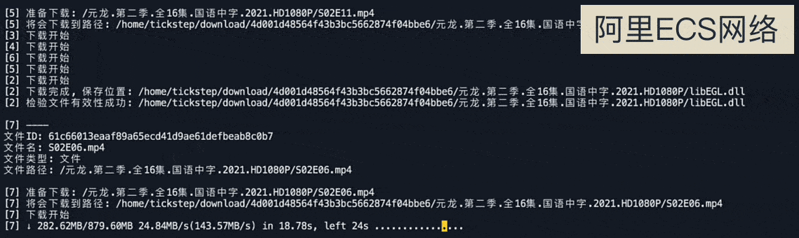
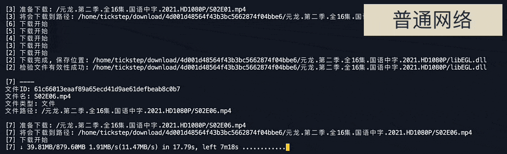
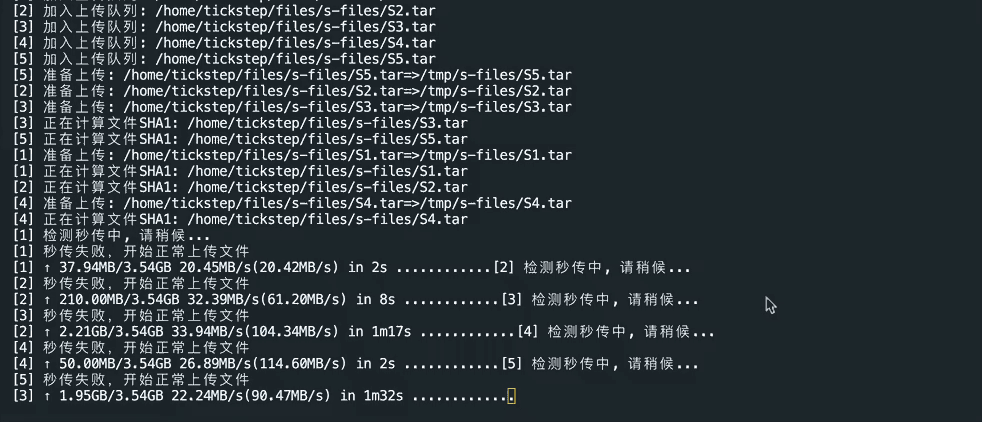
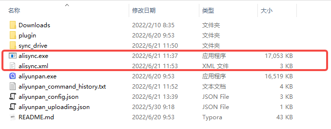
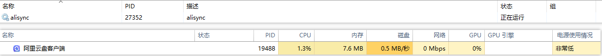
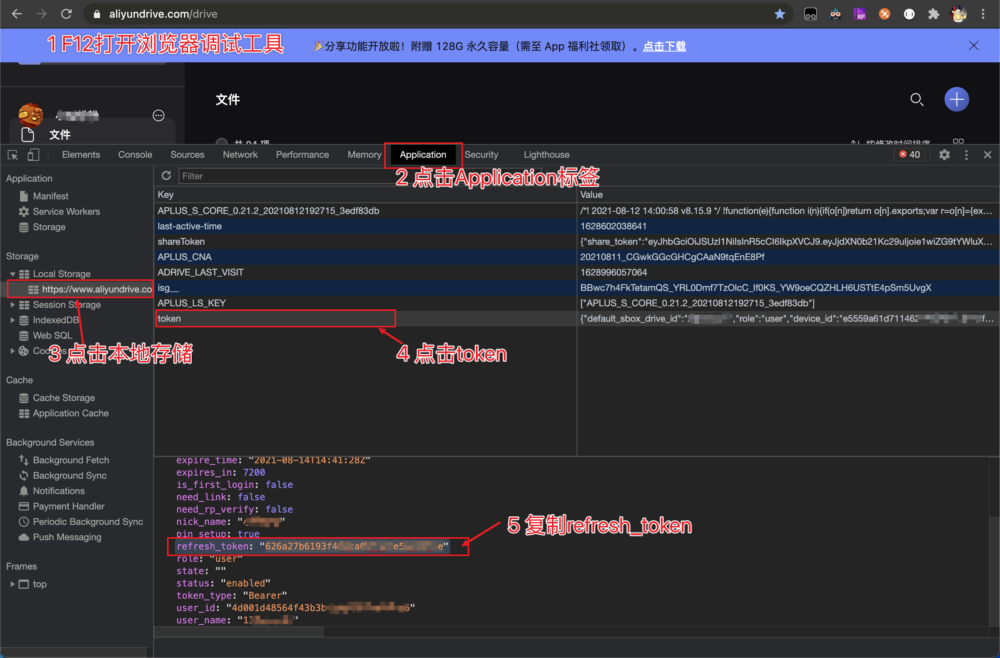
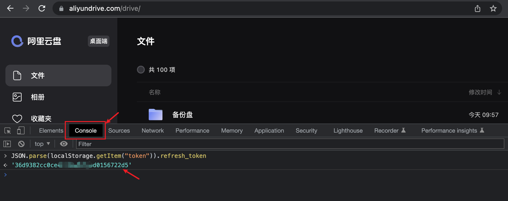

# 目录
- [命令列表及说明](#命令列表及说明)
    * [注意](#注意)
    * [修改配置文件存储路径](#修改配置文件存储路径)
    * [检测程序更新](#检测程序更新)
    * [查看帮助](#查看帮助)
    * [登录阿里云盘帐号](#登录阿里云盘帐号)
    * [列出帐号列表](#列出帐号列表)
    * [获取当前帐号](#获取当前帐号)
    * [切换阿里云盘帐号](#切换阿里云盘帐号)
    * [退出阿里云盘帐号](#退出阿里云盘帐号)
    * [刷新Token](#刷新Token)
    * [切换网盘(备份盘/资源库/相册)](#切换网盘)
    * [获取网盘配额](#获取网盘配额)
    * [切换工作目录](#切换工作目录)
    * [输出工作目录](#输出工作目录)
    * [列出目录](#列出目录)
    * [下载文件/目录](#下载文件目录)
    * [上传文件/目录](#上传文件目录)
    * [创建目录](#创建目录)
    * [删除文件/目录](#删除文件目录)
    * [移动文件/目录](#移动文件目录)
    * [备份盘和资源库之间转存文件](#备份盘和资源库之间转存文件)
    * [重命名文件/目录](#重命名文件目录)
    * [分享文件/目录](#分享文件目录)
        + [设置分享文件/目录](#设置分享文件目录)
        + [列出已分享文件/目录](#列出已分享文件目录)
        + [取消分享文件/目录](#取消分享文件目录)
        + [分享秒传链接](#分享秒传链接)
    * [同步备份功能](#同步备份功能)
        + [常用命令说明](#常用命令说明)
        + [备份配置文件说明](#备份配置文件说明)
        + [命令行启动](#命令行启动)
        + [Linux后台启动](#Linux后台启动)
        + [Windows后台启动](#Windows后台启动)
        + [Docker运行](#Docker运行)
    * [JavaScript插件](#JavaScript插件)
        + [如何使用](#如何使用)
        + [JS中内置的函数](#JS中内置的函数)
        + [常见场景样例](#常见场景样例)
            + [1.禁止特定文件上传](#1.禁止特定文件上传)
            + [2.上传文件后删除本地文件](#2.上传文件后删除本地文件)
            + [3.下载文件并截断过长的文件名](#3.下载文件并截断过长的文件名)
            + [4.上传文件去掉文件名包含的部分字符](#4.上传文件去掉文件名包含的部分字符)
            + [5.Token刷新失败发送外部通知](#5.Token刷新失败发送外部通知)
    * [显示和修改程序配置项](#显示和修改程序配置项)
- [常见问题Q&A](#常见问题Q&A)
    * [1. 如何获取RefreshToken](#1-如何获取RefreshToken)
    * [2. 如何开启Debug调试日志](#2-如何开启Debug调试日志)

# 命令列表及说明
## 注意

命令的前缀 `aliyunpan` 为指向程序运行的全路径名 (ARGv 的第一个参数)

直接运行程序时, 未带任何其他参数, 则程序进入cli交互模式, 进入cli模式运行以下命令时要把命令的前缀 `aliyunpan` 去掉! 即不需要输入`aliyunpan`。

cli交互模式支持按tab键自动补全命令.

## 修改配置文件存储路径
设置环境变量ALIYUNPAN_CONFIG_DIR并指定一个存在目录即可，注意目录需要是绝对路径
```
例如linux下面可以这样指定

export ALIYUNPAN_CONFIG_DIR=/home/tickstep/tools/aliyunpan/config
```

## 检测程序更新
```
aliyunpan update
```

## 查看帮助
```
aliyunpan help
```
### 例子
```
列出程序支持的命令
aliyunpan help

查看login命令的帮助手册
aliyunpan help login
```

## 登录阿里云盘帐号

### 登录
当前支持使用RefreshToken进行登录。RefreshToken请参考 [1. 如何获取RefreshToken](#1-如何获取RefreshToken) 获取
```
aliyunpan login
```

### 例子
```
按照引导步骤登录
aliyunpan login
请输入RefreshToken, 回车键提交 > 626a27b6193f4c5ca6ef0.......

命令行指定RefreshToken登录
aliyunpan login -RefreshToken=626a27b6193f4c5ca6ef0.......

使用二维码方式进行登录，按照引导步骤进行
aliyunpan login -QrCode
```


## 列出帐号列表

```
aliyunpan loglist
```

列出所有已登录的帐号

## 获取当前帐号

```
aliyunpan who
```

## 切换阿里云盘帐号

切换已登录的帐号
```
aliyunpan su <uid>
```
```
aliyunpan su

请输入要切换帐号的 # 值 >
```

## 退出阿里云盘帐号

退出当前登录的帐号
```
aliyunpan logout
```

程序会进一步确认退出帐号, 防止误操作.

## 刷新Token
由于阿里云盘的RefreshToken是会过期的，为了延长最大过期时间，需要定期刷新Token，建议每小时刷新一次。
调用该命令可以自动刷新RefreshToken并保存到配置文件中，但是有一个前提，即Token必须还没有过期，如果Token已经过期是无法刷新的则只能重新登录。
```
刷新当前登录用户
aliyunpan token update

刷新所有登录的用户
aliyunpan token update -mode 2
```

如果你的aliyunpan工具是在Linux中运行，则建议你使用crontab定时任务进行Token自动刷新，例如
```
每小时执行一次Token刷新任务
*/60  * * * * /<your path>/aliyunpan token update -mode 2
```

## 切换网盘
程序默认工作在文件网盘下，如需切换到相册网盘，可以使用本命令进行切换。
```
aliyunpan drive <driveId>
```
```
aliyunpan drive

输入要切换的网盘 # 值 >
```

## 获取网盘配额

```
aliyunpan quota
```
获取网盘的总储存空间, 和已使用的储存空间

## 切换工作目录
```
aliyunpan cd <目录>
```

### 例子
```
# 切换 /我的文档 工作目录
aliyunpan cd /我的文档

# 切换 上级目录
aliyunpan cd ..

# 切换 根目录
aliyunpan cd /

```

## 输出工作目录
```
aliyunpan pwd
```

## 列出目录

列出当前工作目录的文件和目录或指定目录
```
aliyunpan ls
```
```
aliyunpan ls <目录>
```

### 可选参数
```
-driveId value  网盘ID
```

### 例子
```
# 列出 我的文档 内的文件和目录
aliyunpan ls 我的文档

# 绝对路径
aliyunpan ls /我的文档

# 详细列出 我的文档 内的文件和目录
aliyunpan ll /我的文档
```

## 下载文件/目录
下载支持两种链接类型：1-默认类型 2-阿里ECS环境类型   
在普通网络下，下载速度可以达到10MB/s，在阿里ECS（必须是"经典网络"类型的机器）环境下，下载速度单文件可以轻松达到20MB/s，多文件可以达到100MB/s   



```
aliyunpan download <网盘文件或目录的路径1> <文件或目录2> <文件或目录3> ...
aliyunpan d <网盘文件或目录的路径1> <文件或目录2> <文件或目录3> ...
```

### 可选参数
```
  --ow            overwrite, 覆盖已存在的文件
  --skip          skip same name, 跳过已存在的同名文件，即使文件内容不一致(不检查SHA1)
  --status        输出所有线程的工作状态
  --save          将下载的文件直接保存到当前工作目录
  --saveto value  将下载的文件直接保存到指定的目录
  -x              为文件加上执行权限, (windows系统无效)
  -p value        指定下载线程数 (default: 0)
  -l value        指定同时进行下载文件的数量 (default: 0)
  --retry value   下载失败最大重试次数 (default: 3)
  --nocheck       下载文件完成后不校验文件
  --exn value     指定排除的文件夹或者文件的名称，只支持正则表达式。支持排除多个名称，每一个名称就是一个exn参数
```


### 例子
```
# 设置保存目录, 保存到 D:\Downloads
# 注意区别反斜杠 "\" 和 斜杠 "/" !!!
aliyunpan config set -savedir D:/Downloads

# 下载 /我的文档/1.mp4
aliyunpan d /我的文档/1.mp4

# 下载 /我的文档 整个目录!!
aliyunpan d /我的文档
```

下载的文件默认保存到 **程序所在目录** 的 download/ 目录, 支持设置指定目录, 重名的文件会自动跳过!

通过 `aliyunpan config set -savedir <savedir>` 可以自定义保存的目录.

支持多个文件或目录下载.

自动跳过下载重名的文件!

## 上传文件/目录
上传支持两种链接类型：1-默认类型 2-阿里ECS环境类型   
在阿里ECS（必须是"经典网络"类型的机器）环境下，上传速度单文件可以轻松达到30MB/s，多文件可以达到100MB/s   


```
aliyunpan upload <本地文件/目录的路径1> <文件/目录2> <文件/目录3> ... <目标目录>
aliyunpan u <本地文件/目录的路径1> <文件/目录2> <文件/目录3> ... <目标目录>
```

### 例子:
```
# 将本地的 C:\Users\Administrator\Desktop\1.mp4 上传到网盘 /视频 目录
# 注意区别反斜杠 "\" 和 斜杠 "/" !!!
aliyunpan upload C:/Users/Administrator/Desktop/1.mp4 /视频

# 将本地的 C:\Users\Administrator\Desktop\1.mp4 和 C:\Users\Administrator\Desktop\2.mp4 上传到网盘 /视频 目录
aliyunpan upload C:/Users/Administrator/Desktop/1.mp4 C:/Users/Administrator/Desktop/2.mp4 /视频

# 将本地的 C:\Users\Administrator\Desktop 整个目录上传到网盘 /视频 目录
aliyunpan upload C:/Users/Administrator/Desktop /视频

## 下面演示文件或者文件夹排除功能

# 将本地的 C:\Users\Administrator\Video 整个目录上传到网盘 /视频 目录，但是排除所有的.jpg文件
aliyunpan upload -exn "\.jpg$" C:/Users/Administrator/Video /视频

# 将本地的 C:\Users\Administrator\Video 整个目录上传到网盘 /视频 目录，但是排除所有的.jpg文件和.mp3文件，每一个排除项就是一个exn参数
aliyunpan upload -exn "\.jpg$" -exn "\.mp3$" C:/Users/Administrator/Video /视频

以下是典型的排除特定文件或者文件夹的例子，注意：参数值必须是正则表达式
1)排除@eadir文件或者文件夹：-exn "^@eadir$"
2)排除.jpg文件：-exn "\.jpg$"
3)排除.号开头的文件：-exn "^\."
4)排除~号开头的文件：-exn "^~"
5)排除 myfile.txt 文件：-exn "^myfile.txt$"
```

## 手动秒传上传文件
通过秒传链接上传文件到网盘，秒传链接可以通过share命令获取
```
aliyunpan rapidupload <秒传链接1> <秒传链接2> <秒传链接3> ...
```

### 例子:
```
# 如果秒传成功, 则保存到网盘路径 /file.dmg
aliyunpan rapidupload "aliyunpan://file.dmg|752FCCBFB2436A6FFCA3B287831D4FAA5654B07E|7005440|"

# 如果秒传成功, 则保存到网盘路径 /pan_folder/file.dmg
aliyunpan rapidupload "aliyunpan://file.dmg|752FCCBFB2436A6FFCA3B287831D4FAA5654B07E|7005440|pan_folder"

```

## 创建目录
```
aliyunpan mkdir <目录>
```

### 例子
```
aliyunpan mkdir test123
```

## 删除文件/目录
```
aliyunpan rm <网盘文件或目录的路径1> <文件或目录2> <文件或目录3> ...
```

注意: 删除多个文件和目录时, 请确保每一个文件和目录都存在, 否则删除操作会失败.

被删除的文件或目录可在网盘文件回收站找回.

### 例子
```
# 删除 /我的文档/1.mp4
aliyunpan rm /我的文档/1.mp4

# 删除 /我的文档/1.mp4 和 /我的文档/2.mp4
aliyunpan rm /我的文档/1.mp4 /我的文档/2.mp4

# 删除 /我的文档 整个目录 !!
aliyunpan rm /我的文档
```


## 移动文件/目录
```
aliyunpan mv <文件/目录1> <文件/目录2> <文件/目录3> ... <目标目录>
```

注意: 移动多个文件和目录时, 请确保每一个文件和目录都存在, 否则移动操作会失败.

### 例子
```
# 将 /我的文档/1.mp4 移动到 根目录 /
aliyunpan mv /我的文档/1.mp4 /
```

## 备份盘和资源库之间转存文件
```
aliyunpan xcp <文件/目录1> <文件/目录2> <文件/目录3> ... <目标盘目录>
```

注意: 拷贝多个文件和目录时, 请确保每一个文件和目录都存在, 否则拷贝操作会失败

### 例子
```
当前程序工作在备份盘下，将备份盘 /1.mp4 文件转存复制到 资源库下的 /来自备份盘/video 目录下
aliyunpan xcp /1.mp4 /来自备份盘/video

当前程序工作在资源库下，将资源库 /1.mp4 文件转存复制到 备份盘下的 /来自资源库/video 目录下
aliyunpan xcp /1.mp4 /来自资源库/video

当前程序工作在备份盘下，将 /我的资源 目录下所有的.mp4文件 复制到 /来自备份盘/video 目录下面，使用通配符匹配
aliyunpan xcp /我的资源/*.mp4 /来自备份盘/video
```

## 重命名文件/目录
```
aliyunpan rename <旧文件/目录名> <新文件/目录名>
```

注意: 重命名的文件/目录，如果指定的是绝对路径，则必须保证新旧的绝对路径在同一个文件夹内，否则重命名失败！

### 例子
```
# 将 /我的文档/1.mp4 重命名为 /我的文档/2.mp4
aliyunpan rename /我的文档/1.mp4 /我的文档/2.mp4
```

## 分享文件/目录
```
aliyunpan share
```

### 设置分享文件/目录
阿里目前之支持少数文件类型的分享，不支持的文件分享会提示分享失败
```
aliyunpan share set <文件/目录1> <文件/目录2> ...
aliyunpan share s <文件/目录1> <文件/目录2> ...
```

### 列出已分享文件/目录
```
aliyunpan share list
aliyunpan share l
```

### 取消分享文件/目录
```
aliyunpan share cancel <shareid_1> <shareid_2> ...
aliyunpan share c <shareid_1> <shareid_2> ...
```
目前只支持通过分享id (shareid) 来取消分享.


### 分享秒传链接
秒传链接支持所有类型的文件分享，可以突破阿里的分享限制。得到的链接可以使用import或者rapidupload命令保存到自己网盘中。
秒传链接只支持文件分享，不支持文件夹。如果指定文件夹会创建文件夹下所有文件的秒传链接。
```
aliyunpan share mc <文件/目录1> <文件/目录2> ...

例子
# 创建文件 1.mp4 的秒传链接 
aliyunpan share mc 1.mp4

# 创建文件 1.mp4 的秒传链接，但链接隐藏相对路径
aliyunpan share mc -hp 1.mp4

# 创建文件夹 share_folder 下面所有文件的秒传链接
aliyunpan share mc share_folder/
```

## 同步备份功能
同步备份功能，支持备份本地文件到云盘，备份云盘文件到本地，双向同步备份三种模式。支持JavaScript插件对备份文件进行过滤。
指定本地目录和对应的一个网盘目录，以备份文件。网盘目录必须和本地目录独占使用，不要用作其他用途，不然备份可能会有问题。

备份功能支持以下三种模式：
1. 备份本地文件，即上传本地文件到网盘，始终保持本地文件有一个完整的备份在网盘
2. 备份云盘文件，即下载网盘文件到本地，始终保持网盘的文件有一个完整的备份在本地
3. 双向备份，保持网盘文件和本地文件严格一致

备份功能一般用于NAS等系统，进行文件备份。比如备份照片，就可以使用这个功能定期备份照片到云盘，十分好用。

***如果你同步目录下有非常多的文件，最好在首次备份前先运行一次scan任务，等scan任务完成并建立起同步数据库后，再正常启动同步任务。这样同步任务可以更加快速并且能有效避免同步重复文件。***

### 常用命令说明
```
查看同步备份功能说明
aliyunpan sync

查看如何配置和启动同步备份功能
aliyunpan sync start -h

使用命令行配置启动同步备份服务，将本地目录 D:\tickstep\Documents\设计文档 中的文件备份上传到云盘目录 /sync_drive/我的文档
aliyunpan sync start -ldir "D:\tickstep\Documents\设计文档" -pdir "/sync_drive/我的文档" -mode "upload"

使用命令行配置启动同步备份服务，将云盘目录 /sync_drive/我的文档 中的文件备份下载到本地目录 D:\tickstep\Documents\设计文档
aliyunpan sync start -ldir "D:\tickstep\Documents\设计文档" -pdir "/sync_drive/我的文档" -mode "download"

使用命令行配置启动同步备份服务，将本地目录 D:\tickstep\Documents\设计文档 中的文件备份到云盘目录 /sync_drive/我的文档
同时配置下载并发为2，上传并发为1，下载分片大小为256KB，上传分片大小为1MB
aliyunpan sync start -ldir "D:\tickstep\Documents\设计文档" -pdir "/sync_drive/我的文档" -mode "upload" -dp 2 -up 1 -dbs 256 -ubs 1024
    
使用配置文件启动同步备份服务，使用配置文件可以支持同时启动多个备份任务。配置文件必须存在，否则启动失败。
aliyunpan sync start

使用配置文件启动同步备份服务，并配置下载并发为2，上传并发为1，下载分片大小为256KB，上传分片大小为1MB
aliyunpan sync start -dp 2 -up 1 -dbs 256 -ubs 1024

当你本地同步目录文件非常多，或者云盘同步目录文件非常多，为了后期更快更精准同步文件，可以先进行文件扫描并构建同步数据库，然后再正常启动同步任务。如下所示：
aliyunpan sync start -step scan
aliyunpan sync start
```

### 备份配置文件说明
如果你只有一个文件夹进行备份建议直接使用命令行配置启动即可。如果需要同时启动多个备份任务，则可以使用备份配置文件启动同步备份任务。   
配置文件如下所示，如果你有通过环境变量ALIYUNPAN_CONFIG_DIR设置配置目录，则需要将sync_drive文件夹拷贝到配置的目录中才可以生效。
```
配置文件需要保存在：(配置目录)/sync_drive/sync_drive_config.json，样例如下：

{
 "configVer": "1.0",
 "syncTaskList": [
  {
   "name": "设计文档备份",
   "localFolderPath": "D:/tickstep/Documents/设计文档",
   "panFolderPath": "/备份盘/我的文档",
   "mode": "upload"
  },
  {
   "name": "手机图片备份",
   "localFolderPath": "D:/tickstep/Photos/手机图片",
   "panFolderPath": "/备份盘/手机图片",
   "mode": "upload"
  }
 ]
}

相关字段说明如下：
name - 任务名称
localFolderPath - 本地目录
panFolderPath - 网盘目录
mode - 模式，支持三种: upload(备份本地文件到云盘),download(备份云盘文件到本地),sync(双向同步备份)
```

### 命令行启动
需要先进行登录。然后使用以下命令运行即可，该命令是阻塞的不会退出。

```
使用命令行配置启动同步备份服务，将本地目录 /tickstep/Documents/设计文档 中的文件备份上传到云盘目录 /备份盘/我的文档
./aliyunpan sync start -ldir "/tickstep/Documents/设计文档" -pdir "/备份盘/我的文档" -mode "upload"

参数说明
ldir：本地目录
pdir：云盘目录
mode：备份模式，支持：upload(备份本地文件到云盘),download(备份云盘文件到本地),sync(双向同步备份)

--------------------------------------------------------------
正常会有以下的输出：

启动同步备份进程
备份配置文件：(使用命令行配置)
链接类型：默认链接
下载并发：2
上传并发：2
下载分片大小：1.00MB
上传分片大小：10.00MB

启动同步任务
任务: 设计文档(de3d6b69a607497b73624bcca0845f19)
同步模式: 备份本地文件（只上传）
本地目录: /tickstep/Documents/设计文档
云盘目录: /备份盘/我的文档
```

### Linux后台启动
建议结合nohup进行启动。

sync.sh脚本，内容如下
```
# 请更改成你自己的目录
cd /path/to/aliyunpan/folder

chmod +x ./aliyunpan

# 指定refresh token用于登录
./aliyunpan login -RefreshToken=9078907....adg9087

# 上传下载链接类型：1-默认 2-阿里ECS环境
./aliyunpan config set -transfer_url_type 1

# 指定配置参数并进行启动
# 支持的模式：upload(备份本地文件到云盘),download(备份云盘文件到本地),sync(双向同步备份)
./aliyunpan sync start -ldir "/tickstep/Documents/设计文档" -pdir "/备份盘/我的文档" -mode "upload"
```

增加脚本执行权限
```
$ chmod +x sync.sh
```

然后启动该脚本进行后台运行
```
$ nohup ./sync.sh >/dev/null 2>&1 &
```

### Windows后台启动
需要结合 [WinSW](https://github.com/winsw/winsw) 进行后台启动，请前往官网自行下载: https://github.com/winsw/winsw

步骤如下：
1. 配置好备份任务：(配置目录)\sync_drive\sync_drive_config.json
2. 下载winsw.exe并更名为alisync.exe
3. 新增一个alisync.xml文件，内容如下：
```xml
<service>
  <id>alisync</id>
  <name>alisync</name>
  <description>aliyunpan-sync 后台备份服务。</description>
  <env name="ALIYUNPAN_CONFIG_DIR" value="(更改成你PC上aliyunpan.exe工具所在目录)"/>
  <executable>aliyunpan.exe</executable>
  <arguments>sync start</arguments>
  <log mode="roll"></log>
</service>
```
4. 将alisync.exe和alisync.xml存放在你PC上aliyunpan.exe工具所在目录，例如：
   
5. CMD命令行启动程序
```
# 安装服务（只需要第一次安装，后面不用再安装）
D:\Program Files\aliyunpan>alisync install

# 启动服务
D:\Program Files\aliyunpan>alisync start
2022-06-21 13:39:05,795 INFO  - Starting service 'alisync (alisync)'...
2022-06-21 13:39:06,361 INFO  - Service 'alisync (alisync)' started successfully.

# 查看服务状态
D:\Program Files\aliyunpan>alisync status
Started

# 停止服务
D:\Program Files\aliyunpan>alisync stop
2022-06-21 13:42:32,201 INFO  - Stopping service 'alisync (alisync)'...
2022-06-21 13:42:32,211 INFO  - Service 'alisync (alisync)' stopped successfully.
```
效果截图如下   


### Docker运行
详情文档请参考dockerhub网址：[tickstep/aliyunpan-sync](https://hub.docker.com/r/tickstep/aliyunpan-sync)

1. 直接运行
```
docker run -d --name=aliyunpan-sync --restart=always -v "<your local dir>:/home/app/data" -e TZ="Asia/Shanghai" -e ALIYUNPAN_REFRESH_TOKEN="<your refreshToken>" -e ALIYUNPAN_PAN_DIR="<your drive pan dir>" -e ALIYUNPAN_SYNC_MODE="upload" -e ALIYUNPAN_TASK_STEP="sync" tickstep/aliyunpan-sync:<tag>
 
  
<your local dir>：本地目录绝对路径，例如：/tickstep/Documents/设计文档
ALIYUNPAN_PAN_DIR：云盘目录
ALIYUNPAN_REFRESH_TOKEN：RefreshToken
ALIYUNPAN_SYNC_MODE：备份模式，支持三种: upload(备份本地文件到云盘),download(备份云盘文件到本地),sync(双向同步备份)
ALIYUNPAN_TASK_STEP：任务步骤, 支持两种: scan(只扫描并建立同步数据库),sync(正常启动同步任务)。如果你同步目录文件非常多，首次运行最好先跑一次scan步骤，然后再正常启动文件同步任务
```

2. docker-compose运行   
   docker-compose.yml 文件如下所示，为了方便说明增加了相关的注释，部署的时候可以去掉注释。

```
version: '3'
services:
  sync:
    image: tickstep/aliyunpan-sync:<tag>
    container_name: aliyunpan-sync
    restart: always
    volumes:
      # 指定本地备份目录绝对路径：/tickstep/Documents/设计文档
      - /tickstep/Documents/设计文档:/home/app/data:rw
      # （可选）可以指定JS插件sync_handler.js用于过滤文件，详见下面的插件说明
      #- ./plugin/js/sync_handler.js:/home/app/config/plugin/js/sync_handler.js
      # （推荐）挂载sync_drive同步数据库到本地
      #- ./sync_drive:/home/app/config/sync_drive
    environment:
      - TZ=Asia/Shanghai
      # refresh token
      - ALIYUNPAN_REFRESH_TOKEN=41804446a...bf7f069cab2
      # 上传下载链接类型：1-默认 2-阿里ECS环境
      - ALIYUNPAN_TRANSFER_URL_TYPE=1
      # 下载文件并发数
      - ALIYUNPAN_DOWNLOAD_PARALLEL=2
      # 上传文件并发数
      - ALIYUNPAN_UPLOAD_PARALLEL=2
      # 下载数据块大小，单位为KB，默认为10240KB，建议范围1024KB~10240KB
      - ALIYUNPAN_DOWNLOAD_BLOCK_SIZE=1024
      # 上传数据块大小，单位为KB，默认为10240KB，建议范围1024KB~10240KB
      - ALIYUNPAN_UPLOAD_BLOCK_SIZE=10240
      # 指定网盘文件夹作为备份目录，不要指定根目录
      - ALIYUNPAN_PAN_DIR=/备份盘/我的文档
      # 备份模式：upload(备份本地文件到云盘), download(备份云盘文件到本地), sync(双向同步备份)
      - ALIYUNPAN_SYNC_MODE=upload
      # 优先级，只对双向同步备份模式有效。选项支持三种: time-时间优先，local-本地优先，pan-网盘优先
      - ALIYUNPAN_SYNC_PRIORITY=time
      # 是否显示文件备份过程日志，true-显示，false-不显示
      - ALIYUNPAN_SYNC_LOG=true
      # 本地文件修改检测延迟间隔，单位秒。如果本地文件会被频繁修改，例如录制视频文件，配置好该时间可以避免上传未录制好的文件
      - ALIYUNPAN_LOCAL_DELAY_TIME=3
      # 任务步骤, 支持两种: scan(只扫描并建立同步数据库),sync(正常启动同步任务)
      - ALIYUNPAN_TASK_STEP=sync      
```

3. sync_handler.js插件说明   
   可以使用JS插件过滤备份的文件。
```javascript
// ==========================================================================================
// aliyunpan JS插件回调处理函数
// 支持 JavaScript ECMAScript 5.1 语言规范
//
// 更多内容请查看官方文档：https://github.com/tickstep/aliyunpan
// ==========================================================================================

// ------------------------------------------------------------------------------------------
// 函数说明：同步备份-扫描本地文件前的回调函数
//
// 参数说明
// context - 当前调用的上下文信息
// {
// 	"appName": "aliyunpan",
// 	"version": "v0.1.3",
// 	"userId": "11001d48564f43b3bc5662874f04bb11",
// 	"nickname": "tickstep",
// 	"fileDriveId": "19519111",
// 	"albumDriveId": "29519122"
// }
// appName - 应用名称，当前固定为aliyunpan
// version - 版本号
// userId - 当前登录用户的ID
// nickname - 用户昵称
// fileDriveId - 用户文件网盘ID
// albumDriveId - 用户相册网盘ID
//
// params - 扫描本地文件前参数
// {
// 	"localFilePath": "D:\\Program Files\\aliyunpan\\Downloads\\token.bat",
// 	"localFileName": "token.bat",
// 	"localFileSize": 125330,
// 	"localFileType": "file",
// 	"localFileUpdatedAt": "2022-04-14 07:05:12",
// 	"driveId": "19519221"
// }
// localFilePath - 本地文件绝对完整路径
// localFileName - 本地文件名
// localFileSize - 本地文件大小，单位B
// localFileType - 本地文件类型，file-文件，folder-文件夹
// localFileUpdatedAt - 文件修改时间
// driveId - 备份的目标网盘ID
//
// 返回值说明
// {
// 	"syncScanLocalApproved": "yes"
// }
// syncScanLocalApproved - 该文件是否确认扫描，yes-允许扫描，no-禁止扫描。
//                禁止扫描的文件不会执行后续的动作，例如上传，下载。
// ------------------------------------------------------------------------------------------
function syncScanLocalFilePrepareCallback(context, params) {
	console.log(params);
    var result = {
        "syncScanLocalApproved": "yes"
    };

    // 禁止.开头文件上传
    if (params["localFileName"].indexOf(".") == 0) {
        result["syncScanLocalApproved"] = "no";
    }

	// 禁止~$开头文件上传（office暂存临时文件）
    if (params["localFileName"].indexOf("~$") == 0) {
        result["syncScanLocalApproved"] = "no";
    }

    // 禁止.txt文件上传（正则表达式方式）
    if (params["localFileName"].search(/.txt$/i) >= 0) {
        result["syncScanLocalApproved"] = "no";
    }

    // 禁止password.key文件上传
    if (params["localFileName"] == "password.key") {
        result["syncScanLocalApproved"] = "no";
    }
	
	// 禁止@eadir文件上传
	if (params["localFileName"] == "@eadir") {
        result["syncScanLocalApproved"] = "no";
    }
    return result;
}


// ------------------------------------------------------------------------------------------
// 函数说明：同步备份-扫描云盘文件前的回调函数
// 
// 参数说明
// context - 当前调用的上下文信息
// {
// 	"appName": "aliyunpan",
// 	"version": "v0.1.3",
// 	"userId": "11001d48564f43b3bc5662874f04bb11",
// 	"nickname": "tickstep",
// 	"fileDriveId": "19519111",
// 	"albumDriveId": "29519122"
// }
// appName - 应用名称，当前固定为aliyunpan
// version - 版本号
// userId - 当前登录用户的ID
// nickname - 用户昵称
// fileDriveId - 用户文件网盘ID
// albumDriveId - 用户相册网盘ID
//
// params - 扫描云盘文件前参数
// {
// 	"driveId": "19519221",
// 	"driveFileName": "token.bat",
// 	"driveFilePath": "/aliyunpan/Downloads/token.bat",
// 	"driveFileSha1": "08FBE28A5B8791A2F50225E2EC5CEEC3C7955A11",
// 	"driveFileSize": 125330,
// 	"driveFileType": "file",
// 	"driveFileUpdatedAt": "2022-04-14 07:05:12"
// }
// driveId - 网盘ID
// driveFileName - 网盘文件名
// driveFilePath - 网盘文件绝对完整路径
// driveFileSize - 网盘文件大小，单位B
// driveFileSha1 - 网盘文件SHA1
// driveFileType - 网盘文件类型，file-文件，folder-文件夹
// driveFileUpdatedAt - 网盘文件修改时间
// 
// 返回值说明
// {
// 	"syncScanPanApproved": "yes"
// }
// syncScanPanApproved - 该文件是否确认扫描，yes-允许扫描，no-禁止扫描。
//                       禁止扫描的文件不会执行后续的动作，例如上传，下载。
// ------------------------------------------------------------------------------------------
function syncScanPanFilePrepareCallback(context, params) {
    console.log(params);

    var result = {
        "syncScanPanApproved": "yes"
    };

    // 禁止.开头文件下载
    if (params["driveFileName"].indexOf(".") == 0) {
        result["syncScanPanApproved"] = "no";
    }

    // 禁止~$开头文件下载（office暂存临时文件）
    if (params["driveFileName"].indexOf("~$") == 0) {
        result["syncScanPanApproved"] = "no";
    }

    // 禁止.txt文件下载（正则表达式方式）
    // if (params["driveFileName"].search(/.txt$/i) >= 0) {
    //     result["syncScanPanApproved"] = "no";
    // }

    return result;
}
```

## JavaScript插件
支持javascript插件，你可以按照自己的需要定制上传/下载中关键步骤的行为，最大程度满足自己的个性化需求。   
例如：   
1.排除某个特定敏感文件的上传   
2.上传文件进行改名，但是本地文件不做更改   
3.上传完成文件，删除本地文件   
4.上传的文件路径进行更改，但是本地的文件保持不变   
5.上传文件成功后，通过HTTP通知其他服务   
6.排除某些网盘文件的下载   
7.下载的文件进行改名，但是网盘的文件保持不变   
8.下载的文件路径进行更改，但是网盘的文件保持不变   
9.下载文件完成后，通过HTTP通知其他服务   
10.同步备份功能，支持过滤本地文件，或者过滤云盘文件。定制上传或者下载需要同步的文件
11.Token刷新失败或者过期，发送外部通知（HTTP&邮件）

### 如何使用
JS插件的样本文件默认存放在程序所在的plugin/js文件夹下，分为下载(download_handler.js.sample)、上传(upload_handler.js.sample)、同步备份(sync_handler.js.sample)、用户Token(token_handler.js.sample)插件。

建议拷贝一份并将后缀名更改为.js，例如：upload_handler.js，不然插件不会生效。   
你必须具备一定的JS语言基础，然后按照里面的样例根据自己所需进行改动即可。   
如果你有通过环境变量ALIYUNPAN_CONFIG_DIR设置配置目录，则需要将plugin文件夹拷贝到配置的目录中才可以生效。

### JS中内置的函数
目前只开放了如下函数，你可以在你的js脚本中直接调用   
1.console.log()   
打印日志
```js
console.log("hello world");
```

2.PluginUtil.Http.get()   
发起HTTP的get请求
```js
    var header = {
        "User-Agent": "Mozilla/5.0 (Windows NT 10.0; Win64; x64) AppleWebKit/537.36 (KHTML, like Gecko) Chrome/100.0.4896.88 Safari/537.36",
        "Content-Type": "application/json",
        "Accept": "application/json"
    };
    try {
        var r = PluginUtil.Http.get(header, "https://625f528c53a42eaa07f37e13.mockapi.io/files/1");
        console.log(r);
    } catch (e) {
        if (e !== "Error") {
            throw e;
        }
    }
```

3.PluginUtil.Http.post()   
发起HTTP的post请求
```js
    var header = {
        "User-Agent": "Mozilla/5.0 (Windows NT 10.0; Win64; x64) AppleWebKit/537.36 (KHTML, like Gecko) Chrome/100.0.4896.88 Safari/537.36",
        "Content-Type": "application/json",
        "Accept": "application/json"
    };
    try {
        var reqDataStr = JSON.stringify({
            "id": "1",
            "localFilePath": "/usr/local/src/borders_burundi_producer.gram.aab",
            "localFileSize": 1111,
            "uploadApproved": false
        });
        var r = PluginUtil.Http.post(header, "https://625f528c53a42eaa07f37e13.mockapi.io/files", reqDataStr);
        console.log(r);
    } catch (e) {
        if (e !== "Error") {
            throw e;
        }
    }
```

4.PluginUtil.LocalFS.deleteFile()   
删除本地指定文件，不支持文件夹
```js
PluginUtil.LocalFS.deleteFile(params["localFilePath"]);
```

5.PluginUtil.Email.sendTextMail()
发送文本邮件，定义如下
```
PluginUtil.Email.sendTextMail(mailServer, userName, password, to, subject, body)

其中：
mailServer - smtp服务器+端口
userName - 发件人邮箱地址
password - 发件人邮箱密码
to - 收件人邮箱地址
subject - 邮件标题
body - 邮件内容，纯文本
```
样例
```js
PluginUtil.Email.sendTextMail("smtp.qq.com:465", "123xxx@qq.com", "pwdxxxxxx", "12545xxx@qq.com", "文件上传通知", "该文件已经上传完毕");
```

6.PluginUtil.Email.sendHtmlMail()
发送HTML富文本邮件，定义如下
```
PluginUtil.Email.sendHtmlMail(mailServer, userName, password, to, subject, body)

其中：
mailServer - smtp服务器+端口
userName - 发件人邮箱地址
password - 发件人邮箱密码
to - 收件人邮箱地址
subject - 邮件标题
body - 邮件内容，HTML富文本
```
样例
```js
var html = "<html>"
    +"<body>"
    +"<h1>文件上传通知</h1>"
    +"<h2>该文件已经上传完毕</h2>"
    +"</body>"
    +"</html>";
PluginUtil.Email.sendHtmlMail("smtp.qq.com:465", "123xxx@qq.com", "pwdxxxxxx", "12545xxx@qq.com", "文件上传通知", html);
```

7.PluginUtil.KV.putString()
存储键值对，定义如下
```
PluginUtil.KV.putString(key, value)

其中：
key - 键，字符串
value - 值，字符串
```
样例
```js
PluginUtil.KV.putString("mykey", "1670419352");
```

8.PluginUtil.KV.getString()
获取存储的键值，指定对应的键，返回存储的值，如果没有则返回空字符串，定义如下
```
PluginUtil.KV.getString(key)

其中：
key - 键，字符串
```
样例
```js
var value = PluginUtil.KV.getString("mykey");
```

### 常见场景样例
这里收集了一些常见的需求样例，可以作为插件定制的样例模板。

#### 1.禁止特定文件上传
使用JavaScript上传插件中的`uploadFilePrepareCallback`函数。如下所示：
```js
function uploadFilePrepareCallback(context, params) {
    console.log(params)

    var result = {
        "uploadApproved": "yes",
        "driveFilePath": ""
    };
    if (params["localFileType"] != "file") {
        // do nothing
        return result;
    }

    // 禁止点号.开头的文件上传
    if (params["localFileName"].indexOf(".") == 0) {
        result["uploadApproved"] = "no";
    }

    // 禁止.txt文件上传
    if (params["localFileName"].search(/.txt$/i) >= 0) {
        result["uploadApproved"] = "no";
    }

    // 禁止password.key文件上传
    if (params["localFileName"] == "password.key") {
        result["uploadApproved"] = "no";
    }    

    return result;
}
```

#### 2.上传文件后删除本地文件
使用JavaScript上传插件中的`uploadFileFinishCallback`函数。如下所示：
```js
function uploadFileFinishCallback(context, params) {
    console.log(params);
    if (params["localFileType"] != "file") {
        // do nothing
        return;
    }
    if (params["uploadResult"] == "success") {
        PluginUtil.LocalFS.deleteFile(params["localFilePath"]);
    }    
}
```

#### 3.下载文件并截断过长的文件名
有些文件的路径或者名称太长，下载的时候可能会由于路径名称过程导致无法下载，这时候可以使用JavaScript下载插件中的`downloadFilePrepareCallback`函数定制下载保存的文件名。   
如下所示：
```js
function downloadFilePrepareCallback(context, params) {
    console.log(params)

    var result = {
        "downloadApproved": "yes",
        "localFilePath": ""
    };
    if (params["driveFileType"] != "file") {
        return result;
    }
	
    // 下面的代码都是分隔路径，方便后面修改路径时使用
    var filePath =  params["localFilePath"];
    filePath = filePath.replace(/\\/g, "/");
    
    // 目录完整路径
    var dirPath = "";
    // 文件名，不包括后缀名
    var fileName = "";
    // 文件后缀名
    var fileExt = "";
    
    var idx = filePath.lastIndexOf('/');
    if (idx > 0) {
        dirPath = filePath.substring(0,idx);
        fileName = filePath.substring(idx+1,filePath.length);
    } else {
        fileName = filePath;
    }
    idx = fileName.lastIndexOf(".")
    if (idx > 0) {
        fileExt = fileName.substring(idx,fileName.length);
        fileName = fileName.substring(0, fileName.length-fileExt.length)
    }

    // 开始按照需要截断太长的文件路径，例如下面的这个例子:
    // 
    // dirPath + "/"          ==> 这个的意思是保留前面的文件夹路径，如果不需要就去掉
    // fileName.substr(0,10)  ==> 文件名只取前面10个字符，其他的不要了
    // + fileExt              ==> 把文件的后缀名补上
    var saveFilePath = dirPath + "/" + fileName.substr(0,10) + fileExt;

    // 返回
    result["localFilePath"] = saveFilePath;
    return result;
}
```
效果如下:   
1）假如网盘源路径是：`/亚马逊书籍合集/亚马逊 kindle ebook 大合集5289册/经济金融 (2)/解密Instagram（ 《金融时报》和麦肯锡2020年度商业书籍！社交应用如何改变世界？解锁打造估值千亿美元爆品的核心方法！ ) by 莎拉·弗莱尔(z-lib.org).mobi`   
2）下载后保存本地的路径是：`D:\test\亚马逊书籍合集\亚马逊 kindle ebook 大合集5289册\经济金融 (2)\解密Instagra.mobi`   
```
[1] ----
文件ID: 630f0623e67c0a1d2e554b1994a29108d089f0d5
文件名: 解密Instagram（ 《金融时报》和麦肯锡2020年度商业书籍！社交应用如何改变世界？解锁打造估值千亿美元爆品的核心方法！ ) by 莎拉·弗莱尔(z-lib.org).mobi
文件类型: 文件
文件路径: /亚马逊书籍合集/亚马逊 kindle ebook 大合集5289册/经济金融 (2)/解密Instagram（ 《金融时报》和麦肯锡2020年度商业书籍！社交应用如何改变世界？解锁打造估值千亿美元爆品的核心方法！ ) by 莎拉·弗莱尔(z-lib.org).mobi

插件修改文件下载保存路径为: D:\test\亚马逊书籍合集/亚马逊 kindle ebook 大合集5289册/经济金融 (2)/解密Instagra.mobi
[1] 准备下载: /亚马逊书籍合集/亚马逊 kindle ebook 大合集5289册/经济金融 (2)/解密Instagram（ 《金融时报》和麦肯锡2020年度商业书籍！社交应用如何改变世界？解锁打造估值千亿美元爆品的核心方法！ ) by 莎拉·弗莱尔(z-lib.org).mobi
[1] 将会下载到路径: D:\test\亚马逊书籍合集/亚马逊 kindle ebook 大合集5289册/经济金融 (2)/解密Instagra.mobi
[1] 下载开始

[1] 下载完成, 保存位置: D:\test\亚马逊书籍合集/亚马逊 kindle ebook 大合集5289册/经济金融 (2)/解密Instagra.mobi
[1] 检验文件有效性成功: D:\test\亚马逊书籍合集/亚马逊 kindle ebook 大合集5289册/经济金融 (2)/解密Instagra.mobi
```
#### 4.上传文件去掉文件名包含的部分字符
例如本地文件夹名称为```[周杰伦]范特西[mp3]```，上传到网盘希望能更改成名称```[周杰伦]范特西```但保持本地文件夹名称不变，因为文件夹有很多不希望每个手动更改，可以这样实现：
```js
function uploadFilePrepareCallback(context, params) {
    var result = {
        "uploadApproved": "yes",
        "driveFilePath": ""
    };

    // 去掉网盘保存路径中包含的[mp3]字段
    var filePath =  params["driveFilePath"];
    filePath = filePath.replace(/\[mp3\]/g, "");
    result["driveFilePath"] = filePath;

    return result;
}
```

#### 5.Token刷新失败发送外部通知
Token刷新失败发送外部通知，例如Server酱
```js
function userTokenRefreshFinishCallback(context, params) {
    var header = {
        "User-Agent": "Mozilla/5.0 (Windows NT 10.0; Win64; x64) AppleWebKit/537.36 (KHTML, like Gecko) Chrome/100.0.4896.88 Safari/537.36",
        "Content-Type": "application/json",
        "Accept": "application/json"
    };
    try {
        if (params["result"] === "fail") {
            // 避免频繁发送
            var ONE_MINUTE = 60 * 1000;
            var lastSendEmailTime = PluginUtil.KV.getString("email_last_send_time");
            if (lastSendEmailTime != "") {
                if ((Date.now() - lastSendEmailTime) < (10 * ONE_MINUTE)) {
                    console.log("距离上次发送邮件小于10分钟，先不发送了");
                    return
                }
            }
            PluginUtil.KV.putString("email_last_send_time", Date.now());
            
            var reqData = {
                "text": "Token刷新失败",
                "desp": params["message"]
            };
            var r = PluginUtil.Http.post(header, "https://sctapi.ftqq.com/xxxxxkeyxxxxxx.send", JSON.stringify(reqData));
        }
    } catch (e) {
        if (e !== "Error") {
            throw e;
        }
    }
}
```

或者发送邮件通知
```js
function userTokenRefreshFinishCallback(context, params) {
    try {
        if (params["result"] === "fail") {
            // 避免频繁发送
            var ONE_MINUTE = 60 * 1000;
            var lastSendEmailTime = PluginUtil.KV.getString("email_last_send_time");
            if (lastSendEmailTime != "") {
                if ((Date.now() - lastSendEmailTime) < (10 * ONE_MINUTE)) {
                    console.log("距离上次发送邮件小于10分钟，先不发送了");
                    return
                }
            }
            PluginUtil.KV.putString("email_last_send_time", Date.now());

            // 发送通知邮件，请确保你的发送邮箱具备smtp发送权限，没有的需要找邮箱提供商配置开启
            console.log("发送通知邮件");
            PluginUtil.Email.sendTextMail("smtp.qq.com:465", "123xxx@qq.com", "pwdxxxxxx", "12545xxx@qq.com", "Token刷新失败了", "Token过期了，骚年快去手动恢复吧");
        }
    } catch (e) {
        if (e !== "Error") {
            throw e;
        }
    }
}
```

## 显示和修改程序配置项
```
# 显示配置
aliyunpan config

# 设置配置
aliyunpan config set
```


### 例子
```
# 显示所有可以设置的值
aliyunpan config -h
aliyunpan config set -h

# 设置下载文件的储存目录
aliyunpan config set -savedir D:/Downloads

# 设置下载最大并发量为 15
aliyunpan config set -max_download_parallel 15

# 组合设置
aliyunpan config set -max_download_parallel 15 -savedir D:/Downloads

# 设置使用阿里云内部URL链接，专供阿里云ECS环境使用
# 开启内部URL链接可以使用阿里云ECS私网带宽流量，而不用使用宝贵的公网带宽流量，如果你在阿里ECS环境中使用本工具，建议开启
aliyunpan config set -transfer_url_type 2
```

# 常见问题Q&A
## 1 如何获取RefreshToken
需要通过浏览器获取refresh_token。这里以Chrome浏览器为例，其他浏览器类似。   
打开 [阿里云盘网页](https://www.aliyundrive.com/drive) 并进行登录，然后F12按键打开浏览器调试菜单，按照下面步骤进行


或者直接在控制台输入以下命令获取
```
JSON.parse(localStorage.getItem("token")).refresh_token
```


## 2 如何开启Debug调试日志
当需要定位问题，或者提交issue的时候抓取log，则需要开启debug日志。步骤如下：

### 第一步
Linux&MacOS   
命令行运行
```
export ALIYUNPAN_VERBOSE=1
```

Windows   
不同版本会有些许不一样，请自行查询具体方法   
设置示意图如下：


### 第二步
打开aliyunpan命令行程序，任何云盘命令都有类似如下日志输出
