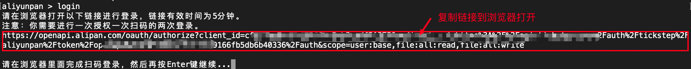
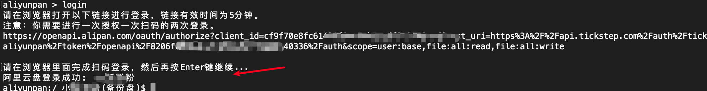
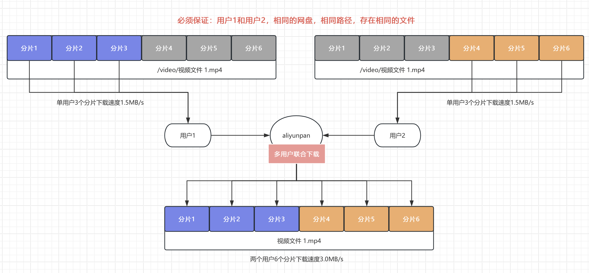

# 目录
- [命令列表及说明](#命令列表及说明)
    * [注意](#注意)
    * [修改配置文件存储路径](#修改配置文件存储路径)
    * [检测程序更新](#检测程序更新)
    * [查看帮助](#查看帮助)
    * [登录阿里云盘帐号](#登录阿里云盘帐号)
    * [列出帐号列表](#列出帐号列表)
    * [获取当前帐号](#获取当前帐号)
    * [切换阿里云盘帐号](#切换阿里云盘帐号)
    * [退出阿里云盘帐号](#退出阿里云盘帐号)
    * [切换网盘(备份盘/资源库)](#切换网盘)
    * [获取网盘配额](#获取网盘配额)
    * [切换工作目录](#切换工作目录)
    * [输出工作目录](#输出工作目录)
    * [列出目录](#列出目录)
    * [下载文件/目录](#下载文件目录)
    * [多用户联合下载](#多用户联合下载)
    * [上传文件/目录](#上传文件目录)
    * [创建目录](#创建目录)
    * [删除文件/目录](#删除文件目录)
    * [移动文件/目录](#移动文件目录)
    * [备份盘和资源库之间转存文件](#备份盘和资源库之间转存文件)
    * [重命名文件/目录](#重命名文件目录)
    * [分享文件/目录](#分享文件目录)
        + [设置分享文件/目录](#设置分享文件目录)
        + [创建快传链接](#创建快传链接)
        + [列出已分享文件/目录](#列出已分享文件目录)
        + [取消分享文件/目录](#取消分享文件目录)
    * [共享相册](#共享相册)
        + [展示共享相簿列表](#展示共享相簿列表)
        + [展示指定相簿中的文件](#展示指定相簿中的文件)
        + [下载相簿中的所有文件](#下载相簿中的所有文件)
    * [同步备份功能](#同步备份功能)
        + [常用命令说明](#常用命令说明)
        + [备份配置文件说明](#备份配置文件说明)
        + [命令行启动](#命令行启动)
        + [Linux后台启动](#Linux后台启动)
        + [Windows后台启动](#Windows后台启动)
        + [Docker运行](#Docker运行)
    * [JavaScript插件](#JavaScript插件)
    * [显示和修改程序配置项](#显示和修改程序配置项)
- [常见问题Q&A](#常见问题QA)
    * [1. 如何开启Debug调试日志](#1-如何开启Debug调试日志)

# 命令列表及说明
## 注意

命令的前缀 `aliyunpan` 为指向程序运行的全路径名 (ARGv 的第一个参数)

直接运行程序时, 未带任何其他参数, 则程序进入cli交互模式, 进入cli模式运行以下命令时要把命令的前缀 `aliyunpan` 去掉! 即不需要输入`aliyunpan`。

cli交互模式支持按tab键自动补全命令.

## 修改配置文件存储路径
设置环境变量ALIYUNPAN_CONFIG_DIR并指定一个存在目录即可，注意目录需要是绝对路径
```
例如linux下面可以这样指定

export ALIYUNPAN_CONFIG_DIR=/home/tickstep/tools/aliyunpan/config
```

## 检测程序更新
```
aliyunpan update
```

## 查看帮助
```
aliyunpan help
```
### 例子
```
列出程序支持的命令
aliyunpan help

查看login命令的帮助手册
aliyunpan help login
```

## 登录阿里云盘帐号

### 登录
当前支持在浏览器进行登录，请输入以下命令按照步骤进行即可。
```
aliyunpan login
```

### 例子
```
aliyunpan > login
请在浏览器打开以下链接进行登录，链接有效时间为5分钟。
https://openapi.alipan.com/oauth/authorize?client_id=cf9f70e8fc61430f8ec5ab5cadf31375&redirect_uri=https%3A%2F%2Fapi.tickstep.com%2Fauth%2Ftickstep%2Faliyunpan%2Ftoken%2Fopenapi%2F8206f0.....fb5db6b40336%2Fauth&scope=user:base,file:all:read,file:all:write
阿里云盘登录成功:  tickstep
aliyunpan:/ tickstep$ 
```
目前登录全部采用网页登录，由于 aliyunpan 融合了阿里官方Open接口+网页Web端接口，所以你需要进行两次登录。输入 login 命令   


复制该链接到浏览器打开，会自动跳转到阿里官方授权登录页面，点击允许完成第一次登录   


接着页面会自动跳转到网页接口登录页面，使用阿里APP扫码完成第二次登录   


然后切换回 aliyunpan 程序，按下 Enter 按键完成登录即可   

   
## 列出帐号列表

```
aliyunpan loglist
```

列出所有已登录的帐号

## 获取当前帐号

```
aliyunpan who
```

## 切换阿里云盘帐号

切换已登录的帐号
```
aliyunpan su <uid>
```
```
aliyunpan su

请输入要切换帐号的 # 值 >
```

## 退出阿里云盘帐号

退出当前登录的帐号
```
aliyunpan logout
```

程序会进一步确认退出帐号, 防止误操作.

## 切换网盘
程序默认工作在文件网盘下，如需切换到资源库网盘，可以使用本命令进行切换。
```
aliyunpan drive <driveId>
```
```
aliyunpan drive

输入要切换的网盘 # 值 >
```

## 获取网盘配额

```
aliyunpan quota
```
获取网盘的总储存空间, 和已使用的储存空间

## 切换工作目录
```
aliyunpan cd <目录>
```

### 例子
```
# 切换 /我的文档 工作目录
aliyunpan cd /我的文档

# 切换 上级目录
aliyunpan cd ..

# 切换 根目录
aliyunpan cd /

```

## 输出工作目录
```
aliyunpan pwd
```

## 列出目录

列出当前工作目录的文件和目录或指定目录
```
aliyunpan ls
```
```
aliyunpan ls <目录>
```

### 可选参数
```
-driveId value  网盘ID
```

### 例子
```
# 列出 我的文档 内的文件和目录
aliyunpan ls 我的文档

# 绝对路径
aliyunpan ls /我的文档

# 详细列出 我的文档 内的文件和目录
aliyunpan ll /我的文档
```

## 下载文件/目录
```
aliyunpan download <网盘文件或目录的路径1> <文件或目录2> <文件或目录3> ...
aliyunpan d <网盘文件或目录的路径1> <文件或目录2> <文件或目录3> ...
```

### 可选参数
```
  --ow            overwrite, 覆盖已存在的文件
  --skip          skip same name, 跳过已存在的同名文件，即使文件内容不一致(不检查SHA1)
  --status        输出所有线程的工作状态
  --save          将下载的文件直接保存到当前工作目录
  --saveto value  将下载的文件直接保存到指定的目录
  -x              为文件加上执行权限, (windows系统无效)
  -p value        指定下载线程数 (default: 0)
  -l value        指定同时进行下载文件的数量 (default: 0)
  --retry value   下载失败最大重试次数 (default: 3)
  --nocheck       下载文件完成后不校验文件
  --exn value     指定排除的文件夹或者文件的名称，只支持正则表达式。支持排除多个名称，每一个名称就是一个exn参数
  --md             (BETA) Multi-User Download，使用多用户联合下载，可以对单一文件叠加所有登录用户的下载速度
```


### 例子
```
# 设置保存目录, 保存到 D:\Downloads
# 注意区别反斜杠 "\" 和 斜杠 "/" !!!
aliyunpan config set -savedir D:/Downloads

# 下载 /我的文档/1.mp4
aliyunpan d /我的文档/1.mp4

# 下载 /我的文档 整个目录!!
aliyunpan d /我的文档
```

下载的文件默认保存到 **程序所在目录** 的 download/ 目录, 支持设置指定目录, 重名的文件会自动跳过!

通过 `aliyunpan config set -savedir <savedir>` 可以自定义保存的目录。   
支持多个文件或目录下载，支持自动跳过下载重名的文件!   

### Linux后台下载
需要结合nohup进行启动。
   
新建 download.sh 脚本，内容如下
```
#!/bin/bash

# 是否开启调试日志
export ALIYUNPAN_VERBOSE=0
# （可选）配置目录的绝对路径（请更改成你自己的目录）
export ALIYUNPAN_CONFIG_DIR=/Users/tickstep/Applications/adrive/config
# aliyunpan程序所在的绝对路径（请更改成你自己的目录）
export ALIYUNPAN_BIN=/Users/tickstep/Applications/adrive/aliyunpan

# 本地目录（请更改成你自己的目录）
LOCAL_DIR="/tickstep/Documents/我的文档"
# 网盘目录（请更改成你自己的目录）
PAN_DIR="/我的文档"

# 执行下载
"$ALIYUNPAN_BIN" download --saveto "$LOCAL_DIR" "$PAN_DIR"
```

增加脚本执行权限
```
$ chmod +x download.sh
```

然后启动该脚本进行后台运行
```
$ nohup ./download.sh > aliyunpan.log 2>&1 &
```

## 多用户联合下载
前提：程序必须登录多个帐号，并且登录授权都有效。   
```
# 使用多用户联合下载 /我的资源/1.mp4 文件。必须保证所有登录的用户在相同的网盘（备份盘/资源盘）下，相同的路径下，有相同的文件
aliyunpan download /我的资源/1.mp4 -md
```
什么是多用户联合下载？   
由于阿里云盘的限制，一个用户下载的时候只能有3个线程并发数，未开通三方权益包的账号一个下载线程速度大概是500KB/s，3个并发即为1.5MB/s。   
多用户联合下载，即是多个用户同时下载同一个文件，每个用户并发3个线程，N个用户即能开启 Nx3 个线程，对应的下载速度叠加为 Nx1.5MB/s。   
对下载速度有极致追求的用户可以尝试使用该选项。   
如果你的账号都开通了三方权益包，则一个用户下载速度为50MB/s，两个用户联合下载可以轻松突破100MB/s。   


## 上传文件/目录
```
aliyunpan upload <本地文件/目录的路径1> <文件/目录2> <文件/目录3> ... <目标目录>
aliyunpan u <本地文件/目录的路径1> <文件/目录2> <文件/目录3> ... <目标目录>
```

### 例子:
```
# 将本地的 C:\Users\Administrator\Desktop\1.mp4 上传到网盘 /视频 目录
# 注意区别反斜杠 "\" 和 斜杠 "/" !!!
aliyunpan upload C:/Users/Administrator/Desktop/1.mp4 /视频

# 将本地的 C:\Users\Administrator\Desktop\1.mp4 和 C:\Users\Administrator\Desktop\2.mp4 上传到网盘 /视频 目录
aliyunpan upload C:/Users/Administrator/Desktop/1.mp4 C:/Users/Administrator/Desktop/2.mp4 /视频

# 将本地的 C:\Users\Administrator\Desktop 整个目录上传到网盘 /视频 目录
aliyunpan upload C:/Users/Administrator/Desktop /视频

## 下面演示文件或者文件夹排除功能

# 将本地的 C:\Users\Administrator\Video 整个目录上传到网盘 /视频 目录，但是排除所有的.jpg文件
aliyunpan upload -exn "\.jpg$" C:/Users/Administrator/Video /视频

# 将本地的 C:\Users\Administrator\Video 整个目录上传到网盘 /视频 目录，但是排除所有的.jpg文件和.mp3文件，每一个排除项就是一个exn参数
aliyunpan upload -exn "\.jpg$" -exn "\.mp3$" C:/Users/Administrator/Video /视频

以下是典型的排除特定文件或者文件夹的例子，注意：参数值必须是正则表达式
1)排除@eadir文件或者文件夹：-exn "^@eadir$"
2)排除.jpg文件：-exn "\.jpg$"
3)排除.号开头的文件：-exn "^\."
4)排除~号开头的文件：-exn "^~"
5)排除 myfile.txt 文件：-exn "^myfile.txt$"
```
### Linux后台上传
需要结合nohup进行启动。   
   
新建 upload.sh 脚本，内容如下
```
#!/bin/bash

# 是否开启调试日志
export ALIYUNPAN_VERBOSE=0
# （可选）配置目录的绝对路径（请更改成你自己的目录）
export ALIYUNPAN_CONFIG_DIR=/Users/tickstep/Applications/adrive/config
# aliyunpan程序所在的绝对路径（请更改成你自己的目录）
export ALIYUNPAN_BIN=/Users/tickstep/Applications/adrive/aliyunpan

# 本地目录（请更改成你自己的目录）
LOCAL_DIR="/tickstep/Documents/我的文档"
# 网盘目录（请更改成你自己的目录）
PAN_DIR="/我的文档"

# 执行上传
$ALIYUNPAN_BIN upload -exn "^\." -exn "^@eadir$" "$LOCAL_DIR" $PAN_DIR" 
```

增加脚本执行权限
```
$ chmod +x upload.sh
```

然后启动该脚本进行后台运行
```
$ nohup ./upload.sh > aliyunpan.log 2>&1 &
```

## 创建目录
```
aliyunpan mkdir <目录>
```

### 例子
```
aliyunpan mkdir test123
```

## 删除文件/目录
```
aliyunpan rm <网盘文件或目录的路径1> <文件或目录2> <文件或目录3> ...
```

注意: 删除多个文件和目录时, 请确保每一个文件和目录都存在, 否则删除操作会失败.

被删除的文件或目录可在网盘文件回收站找回.

### 例子
```
# 删除 /我的文档/1.mp4
aliyunpan rm /我的文档/1.mp4

# 删除 /我的文档/1.mp4 和 /我的文档/2.mp4
aliyunpan rm /我的文档/1.mp4 /我的文档/2.mp4

# 删除 /我的文档 整个目录 !!
aliyunpan rm /我的文档
```


## 移动文件/目录
```
aliyunpan mv <文件/目录1> <文件/目录2> <文件/目录3> ... <目标目录>
```

注意: 移动多个文件和目录时, 请确保每一个文件和目录都存在, 否则移动操作会失败.

### 例子
```
# 将 /我的文档/1.mp4 移动到 根目录 /
aliyunpan mv /我的文档/1.mp4 /
```

## 备份盘和资源库之间转存文件
```
aliyunpan xcp <文件/目录1> <文件/目录2> <文件/目录3> ... <目标盘目录>
```

注意: 拷贝多个文件和目录时, 请确保每一个文件和目录都存在, 否则拷贝操作会失败

### 例子
```
当前程序工作在备份盘下，将备份盘 /1.mp4 文件转存复制到 资源库下的 /来自备份盘/video 目录下
aliyunpan xcp /1.mp4 /来自备份盘/video

当前程序工作在资源库下，将资源库 /1.mp4 文件转存复制到 备份盘下的 /来自资源库/video 目录下
aliyunpan xcp /1.mp4 /来自资源库/video

当前程序工作在备份盘下，将 /我的资源 目录下所有的.mp4文件 复制到 /来自备份盘/video 目录下面，使用通配符匹配
aliyunpan xcp /我的资源/*.mp4 /来自备份盘/video
```

## 重命名文件/目录
```
aliyunpan rename <旧文件/目录名> <新文件/目录名>
```

注意: 重命名的文件/目录，如果指定的是绝对路径，则必须保证新旧的绝对路径在同一个文件夹内，否则重命名失败！

### 例子
```
# 将 /我的文档/1.mp4 重命名为 /我的文档/2.mp4
aliyunpan rename /我的文档/1.mp4 /我的文档/2.mp4
```

## 分享文件/目录
```
aliyunpan share
```

### 设置分享文件/目录
阿里目前只支持少数文件类型的分享，不支持的文件分享会提示分享失败
```
aliyunpan share set -mode 1 <文件/目录1> <文件/目录2> ...
```

### 创建快传链接
阿里的快传支持大部分文件的共享，例如zip压缩包，按照如下方式可以创建快传链接
```
aliyunpan share set -mode 3 <文件/目录1> <文件/目录2> ...
```

### 列出已分享文件/目录
```
aliyunpan share list
```

### 取消分享文件/目录
```
aliyunpan share cancel <shareid_1> <shareid_2> ...
```
目前只支持通过分享id (shareid) 来取消分享.

## 共享相册
```
aliyunpan album
```

### 展示共享相簿列表
```
aliyunpan album list
```

### 展示指定相簿中的文件
展示相簿中文件，同名的相簿只会展示第一个符合条件的
```
例如：展示相簿中文件"我的相簿2025"
aliyunpan album list-file "我的相簿2025"
```

### 下载相簿中的所有文件
下载相簿中的所有文件到本地，支持普通照片、实况照片。
```
下载相簿 "我的相簿2025" 里面的所有文件
aliyunpan album download-file 我的相簿2025
```

## 同步备份功能
同步备份功能，支持备份本地文件到云盘，备份云盘文件到本地两种模式。支持JavaScript插件对备份文件进行过滤。
指定本地目录和对应的一个网盘目录，以备份文件。网盘目录必须和本地目录独占使用，不要用作其他用途，不然备份可能会有问题。
   
备份功能支持以下模式：   
1. 备份本地文件，即上传本地文件到网盘，始终保持本地文件有一个完整的备份在网盘
2. 备份云盘文件，即下载网盘文件到本地，始终保持网盘的文件有一个完整的备份在本地
   
备份功能支持指定备份策略：
1. exclusive，排他备份文件，目标目录多余的文件会被删除。保证备份的源目录，和目标目录文件一比一备份。源目录文件如果文件被删除，则对应的目标目录的文件也会被删除。
2. increment，增量备份文件，目标目录多余的文件不会被删除。只会把源目录修改的文件，新增的文件备份到目标目录。如果源目录有文件删除，或者目标目录有其他文件新增是不会被删除。
   
备份功能一般用于NAS等系统，进行文件备份。比如备份照片，就可以使用这个功能定期备份照片到云盘。   
   
同步的基本逻辑如下所示，一次循环包括：扫描-对比-执行，一共三个环节。   


### 常用命令说明
```
查看同步备份功能说明
aliyunpan sync

查看如何配置和启动同步备份功能
aliyunpan sync start -h

使用命令行配置启动同步备份服务，将本地目录 D:\tickstep\Documents\设计文档 中的文件备份上传到云盘目录 /sync_drive/我的文档
aliyunpan sync start -ldir "D:\tickstep\Documents\设计文档" -pdir "/sync_drive/我的文档" -mode "upload"

使用命令行配置启动同步备份服务，将云盘目录 /sync_drive/我的文档 中的文件备份下载到本地目录 D:\tickstep\Documents\设计文档
aliyunpan sync start -ldir "D:\tickstep\Documents\设计文档" -pdir "/sync_drive/我的文档" -mode "download"

使用命令行配置启动同步备份服务，将本地目录 D:\tickstep\Documents\设计文档 中的文件备份到云盘目录 /sync_drive/我的文档
同时配置下载并发为2，上传并发为1，下载分片大小为256KB，上传分片大小为1MB
aliyunpan sync start -ldir "D:\tickstep\Documents\设计文档" -pdir "/sync_drive/我的文档" -mode "upload" -dp 2 -up 1 -dbs 256 -ubs 1024
    
使用配置文件启动同步备份服务，使用配置文件可以支持同时启动多个备份任务。配置文件必须存在，否则启动失败。
aliyunpan sync start

使用配置文件启动同步备份服务，并配置下载并发为2，上传并发为1，下载分片大小为256KB，上传分片大小为1MB
aliyunpan sync start -dp 2 -up 1 -dbs 256 -ubs 1024
```

### 备份配置文件说明
如果你只有一个文件夹进行备份建议直接使用命令行配置启动即可。如果需要同时启动多个备份任务，则可以使用备份配置文件启动同步备份任务。   
配置文件如下所示，如果你有通过环境变量ALIYUNPAN_CONFIG_DIR设置配置目录，则需要将sync_drive文件夹拷贝到配置的目录中才可以生效。
```
配置文件需要保存在：(配置目录)/sync_drive/sync_drive_config.json，样例如下：

{
 "configVer": "1.0",
 "syncTaskList": [
  {
   "name": "设计文档备份",
   "localFolderPath": "D:/tickstep/Documents/设计文档",
   "panFolderPath": "/备份盘/我的文档",
   "mode": "upload",
   "driveName": "backup"
  },
  {
   "name": "手机图片备份",
   "localFolderPath": "D:/tickstep/Photos/手机图片",
   "panFolderPath": "/备份盘/手机图片",
   "mode": "upload",
   "driveName": "resource"
  }
 ]
}

相关字段说明如下：
name - 任务名称
localFolderPath - 本地目录
panFolderPath - 网盘目录
mode - 模式，支持: upload(备份本地文件到云盘),download(备份云盘文件到本地)
driveName - 网盘，支持：backup(备份盘), resource(资源盘)
```

### 命令行启动
需要先进行登录。然后使用以下命令运行即可，该命令是阻塞的不会退出。

```
使用命令行配置启动同步备份服务，将本地目录 /tickstep/Documents/设计文档 中的文件备份上传到云盘目录 /备份盘/我的文档
./aliyunpan sync start -ldir "/tickstep/Documents/设计文档" -pdir "/备份盘/我的文档" -mode "upload" -drive "backup"

参数说明
ldir：本地目录
pdir：云盘目录
mode：备份模式，支持：upload(备份本地文件到云盘),download(备份云盘文件到本地)
drive - 网盘，支持：backup(备份盘), resource(资源盘)

--------------------------------------------------------------
正常会有以下的输出：

启动同步备份进程
备份配置文件：(使用命令行配置)
链接类型：默认链接
下载并发：2
上传并发：2
下载分片大小：1.00MB
上传分片大小：10.00MB

启动同步任务
任务: 设计文档(de3d6b69a607497b73624bcca0845f19)
同步模式: 备份本地文件（只上传）
本地目录: /tickstep/Documents/设计文档
云盘目录: /备份盘/我的文档
```

### Linux后台启动
建议结合nohup进行启动。

sync.sh脚本，内容如下
```
#!/bin/bash

# 是否开启调试日志
export ALIYUNPAN_VERBOSE=0
# （可选）配置目录的绝对路径（请更改成你自己的目录）
export ALIYUNPAN_CONFIG_DIR=/Users/tickstep/Applications/adrive/config
# aliyunpan程序所在的绝对路径（请更改成你自己的目录）
export ALIYUNPAN_BIN=/Users/tickstep/Applications/adrive/aliyunpan

# 本地目录（请更改成你自己的目录）
LOCAL_DIR="/tickstep/Documents/设计文档"
# 网盘目录（请更改成你自己的目录）
PAN_DIR="/备份盘/我的文档"

# 指定配置参数并进行启动
# 支持的模式：upload(备份本地文件到云盘),download(备份云盘文件到本地)
"$ALIYUNPAN_BIN" sync start -ldir "$LOCAL_DIR" -pdir "$PAN_DIR" -mode "upload" -drive "backup"
```

增加脚本执行权限
```
$ chmod +x sync.sh
```

然后启动该脚本进行后台运行
```
$ nohup ./sync.sh >/dev/null 2>&1 &
```

### Windows后台启动
需要结合 [WinSW](https://github.com/winsw/winsw) 进行后台启动，请前往官网自行下载: https://github.com/winsw/winsw

步骤如下：
1. 配置好备份任务：(配置目录)\sync_drive\sync_drive_config.json
2. 下载winsw.exe并更名为alisync.exe
3. 新增一个alisync.xml文件，内容如下：
```xml
<service>
  <id>alisync</id>
  <name>alisync</name>
  <description>aliyunpan-sync 后台备份服务。</description>
  <env name="ALIYUNPAN_CONFIG_DIR" value="(更改成你PC上aliyunpan.exe工具所在目录)"/>
  <executable>aliyunpan.exe</executable>
  <arguments>sync start</arguments>
  <log mode="roll"></log>
</service>
```
4. 将alisync.exe和alisync.xml存放在你PC上aliyunpan.exe工具所在目录，例如：   

5. CMD命令行启动程序
```
# 安装服务（只需要第一次安装，后面不用再安装）
D:\Program Files\aliyunpan>alisync install

# 启动服务
D:\Program Files\aliyunpan>alisync start
2022-06-21 13:39:05,795 INFO  - Starting service 'alisync (alisync)'...
2022-06-21 13:39:06,361 INFO  - Service 'alisync (alisync)' started successfully.

# 查看服务状态
D:\Program Files\aliyunpan>alisync status
Started

# 停止服务
D:\Program Files\aliyunpan>alisync stop
2022-06-21 13:42:32,201 INFO  - Stopping service 'alisync (alisync)'...
2022-06-21 13:42:32,211 INFO  - Service 'alisync (alisync)' stopped successfully.
```
效果截图如下   


### Docker运行
详情文档请参考dockerhub网址：[tickstep/aliyunpan-sync](https://hub.docker.com/r/tickstep/aliyunpan-sync)

1. 直接运行
```
docker run -d --name=aliyunpan-sync --restart=always -v "<your aliyunpan_config.json>:/home/app/config/aliyunpan_config.json" -v "<your local dir>:/home/app/data" -e ALIYUNPAN_PAN_DIR="<your drive pan dir>" -e ALIYUNPAN_SYNC_MODE="upload" -e ALIYUNPAN_SYNC_POLICY="increment" -e ALIYUNPAN_SYNC_DRIVE="backup" -e ALIYUNPAN_SYNC_LOG="true" tickstep/aliyunpan-sync:<tag>
  
<your aliyunpan_config.json>: 用户已经登录成功并保存好的aliyunpan_config.json凭据文件
<your local dir>：本地目标目录，绝对路径，例如：/tickstep/Documents/设计文档
ALIYUNPAN_PAN_DIR：云盘目标目录，绝对路径
ALIYUNPAN_SYNC_MODE：备份模式，支持: upload(备份本地文件到云盘),download(备份云盘文件到本地)
ALIYUNPAN_SYNC_POLICY：备份策略，支持：exclusive(排他备份文件，目标目录多余的文件会被删除),increment(增量备份文件，目标目录多余的文件不会被删除)
ALIYUNPAN_SYNC_DRIVE: 网盘，支持：backup(备份盘), resource(资源盘)
ALIYUNPAN_SYNC_LOG: 同步日志，true-开启同步日志显示，false-关闭同步日志
```

2. docker-compose运行   
   docker-compose.yml 文件如下所示，为了方便说明增加了相关的注释，部署的时候可以去掉注释。

```
version: '3'
services:
  sync:
    image: tickstep/aliyunpan-sync:<tag>
    container_name: aliyunpan-sync
    restart: always
    volumes:
      # （必须）映射的本地目录
      - ./data:/home/app/data:rw
      # （可选）可以指定JS插件sync_handler.js用于过滤文件，详见插件说明
      #- ./plugin/js/sync_handler.js:/home/app/config/plugin/js/sync_handler.js
      # （推荐）挂载sync_drive同步数据库到本地，这样即使容器销毁，同步数据库还可以用于以后使用
      #- ./sync_drive:/home/app/config/sync_drive
      # （必须）映射token凭据文件
      - /your/file/path/for/aliyunpan_config.json:/home/app/config/aliyunpan_config.json
    environment:
      # 时区，东8区
      - TZ=Asia/Shanghai
      # 下载文件并发数
      - ALIYUNPAN_DOWNLOAD_PARALLEL=2
      # 上传文件并发数
      - ALIYUNPAN_UPLOAD_PARALLEL=2
      # 下载数据块大小，单位为KB，默认为10240KB，建议范围1024KB~10240KB
      - ALIYUNPAN_DOWNLOAD_BLOCK_SIZE=1024
      # 上传数据块大小，单位为KB，默认为10240KB，建议范围1024KB~10240KB
      - ALIYUNPAN_UPLOAD_BLOCK_SIZE=10240
      # 指定网盘文件夹作为备份目标目录，不要指定根目录
      - ALIYUNPAN_PAN_DIR=/my_sync_dir
      # 备份模式：upload(备份本地文件到云盘), download(备份云盘文件到本地)
      - ALIYUNPAN_SYNC_MODE=upload
      # 备份策略: exclusive(排他备份文件，目标目录多余的文件会被删除),increment(增量备份文件，目标目录多余的文件不会被删除)
      - ALIYUNPAN_SYNC_POLICY=increment
      # 备份周期, 支持两种: infinity(永久循环备份),onetime(只运行一次备份)
      - ALIYUNPAN_SYNC_CYCLE=infinity
      # 网盘：backup(备份盘), resource(资源盘)
      - ALIYUNPAN_SYNC_DRIVE=backup
      # 是否显示文件备份过程日志，true-显示，false-不显示
      - ALIYUNPAN_SYNC_LOG=true
      # 本地文件修改检测延迟间隔，单位秒。如果本地文件会被频繁修改，例如录制视频文件，配置好该时间可以避免上传未录制好的文件
      - ALIYUNPAN_LOCAL_DELAY_TIME=3
```

3. sync_handler.js插件说明   
可以使用JS插件过滤备份的文件。更多细节请查看文档：[JavaScript插件手册](https://github.com/tickstep/aliyunpan/blob/main/docs/plugin_manual.md#如何使用)

## JavaScript插件
本程序支持javascript插件，更多细节请查看文档：[JavaScript插件手册](https://github.com/tickstep/aliyunpan/blob/main/docs/plugin_manual.md)

## 显示和修改程序配置项
```
# 显示配置
aliyunpan config

# 设置配置
aliyunpan config set
```


### 例子
```
# 显示所有可以设置的值
aliyunpan config -h
aliyunpan config set -h

# 设置下载文件的储存目录
aliyunpan config set -savedir D:/Downloads

# 设置下载最大并发量为 15
aliyunpan config set -max_download_parallel 15

# 组合设置
aliyunpan config set -max_download_parallel 15 -savedir D:/Downloads
```

# 常见问题Q&A
## 1 如何开启Debug调试日志
当需要定位问题，或者提交issue的时候抓取log，则需要开启debug日志。步骤如下：

### 第一步
Linux&MacOS   
命令行运行
```
export ALIYUNPAN_VERBOSE=1
```

Windows   
不同版本会有些许不一样，请自行查询具体方法   
设置示意图如下：


### 第二步
打开aliyunpan命令行程序，任何云盘命令都有类似如下日志输出
